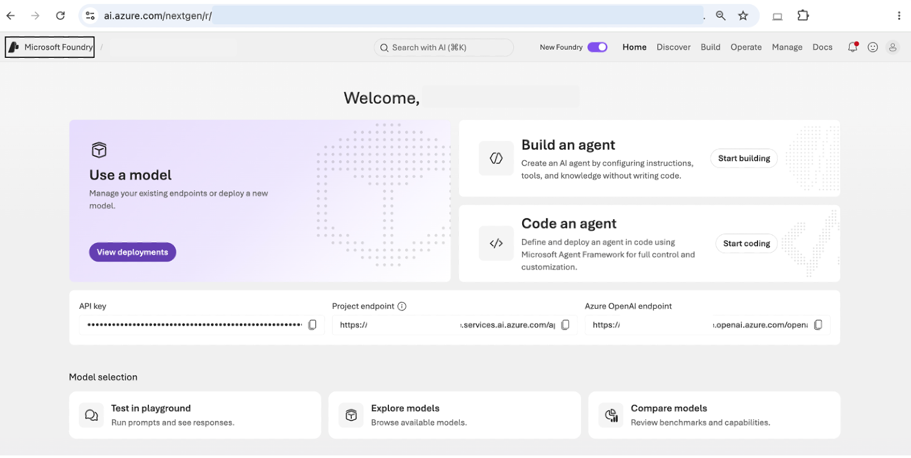

## Module 1.0: Meet your model (10 minutes)

No code in this module. You will find Claude in Foundry, talk to it, and
change how it behaves with a system prompt.

### Sign in

1. Open [https://ai.azure.com](https://ai.azure.com) and sign in with the
   workshop account.
2. If the top bar has a **New Foundry** toggle, turn it on. The workshop
   project is pre-selected.



### Find the Claude deployment

1. In the left navigation choose **Build**, then **Models**.
2. Open the **Deployments** tab. You will see a Claude Sonnet deployment
   (the name matches 'FOUNDRY_MODEL_DEPLOYMENT' in your '.env') and a Claude
   Haiku deployment.


> **Model vs. deployment.** A model is what Anthropic ships. A deployment is
> your project's copy of it with a name, an endpoint, and quota. Your code
> always talks to the deployment name.

### Give it a role

Click the Sonnet deployment, then **Open in playground**. Find the
**Instructions** panel (the system prompt) and paste:

```
You are the order assistant for Sparkles Cupcakes, a small cupcake shop.
```

Then, in the chat box, ask: 'It is my daughter's birthday and she is eight.
What should I order?'

One sentence, and you have a shop assistant. No examples, no formatting rules,
no 'be polite'. In the code you write next, the same field is called
'instructions'.

### Find the edge

You will get back something like this:

```
Here are some ideas that are popular with kids her age:
  Vanilla with pink frosting, Chocolate with rainbow sprinkles, Funfetti
  Rainbow cupcakes - colorful inside, very magical!
  Unicorn cupcakes - super popular with 8-year-olds
  Strawberry with whipped frosting
```

However, none of these are actual Sparkles flavors! The model invented them.

You told it that it works at a cupcake shop. You did not tell it what the shop
sells, so it filled that in.

Now ask: 'What's your refund policy?'

You will get a reasonable-sounding policy, and it is invented too. Nothing you
told it says what Sparkles actually does. That is the real risk: not that the
model refuses, but that it answers confidently and plausibly with something
that is not your shop's policy.

Module 1.2 gives it the real menu. Module 1.3 gives it the real policies.

### Look at the code

Click the **Continue in code** button. This is the same call you will make from Python in the
next module. Note the three things it needs: the endpoint, a key, and the
deployment name.


**Checkpoint 1.** You have talked to Claude on Foundry, and seen what it does
and does not know about your shop.
