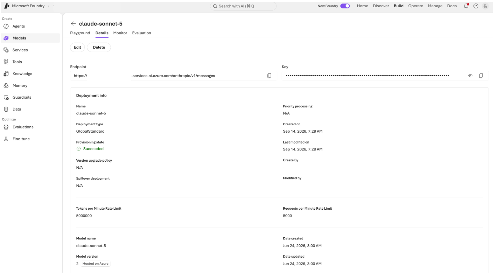

## Module 1.1: Hello world agent (10 minutes)

Time to build the agent in Python. The framework you will use wraps a chat
model, a conversation session, and tools into one 'Agent' object.

### Check your settings

Open the '.env' file at the top of the repo in VS Code. It needs three
values, all from the Playground's **Details** tab:

```
FOUNDRY_ENDPOINT="https://<your-resource>.services.ai.azure.com/anthropic"
FOUNDRY_API_KEY="<key>"
FOUNDRY_MODEL_DEPLOYMENT="claude-sonnet-5"
```

If your instructor pre-filled the file, leave it alone. If not, copy
**Endpoint**, **Key**, and the deployment **Name** into it now.

One thing to watch: the portal shows the endpoint ending in '/v1/messages',
but the value here must stop at '/anthropic'. The client appends
'/v1/messages' itself when it calls the API, so leaving it on asks for
'/anthropic/v1/messages/v1/messages', which 404s.



> Treat the key like a password. '.env' is in '.gitignore' so it never gets
> committed.

### Read the starting agent

Open 'sparkles-agent/agent.py'. It does four things:

```python-notype
# 2. The chat model: Claude on Microsoft Foundry
chat_client = AnthropicFoundryClient(
    model=os.environ["FOUNDRY_MODEL_DEPLOYMENT"],
    api_key=os.environ["FOUNDRY_API_KEY"],
    base_url=os.environ["FOUNDRY_ENDPOINT"],
)

# 3. The agent
agent = Agent(client=chat_client, name="cupcake-agent")

# 4. A session keeps the conversation history
session = agent.create_session()
```

Then a loop reads what you type, calls 'agent.run(...)', and prints the reply.

### Run it

In the terminal:

```
cd sparkles-agent
python agent.py
```

Type 'Hello!' and you should get a friendly reply. Type 'exit' to stop.

**Checkpoint 2.** A terminal conversation with your own agent.

If it fails: a '401' means the key or endpoint is wrong; 'DeploymentNotFound'
means the deployment name does not match the portal exactly.
