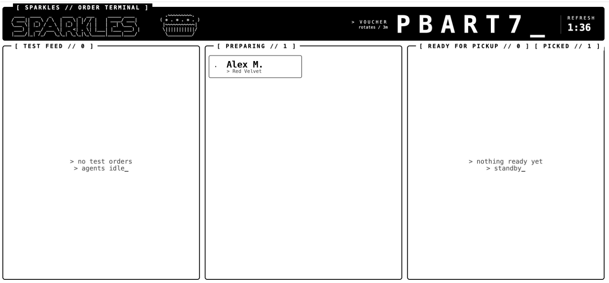

## Module 1.2: Tools and a personality (15 minutes)

An agent that only chats cannot take an order. To check stock and place
orders it needs **tools**, and to sound like Sparkles it needs a persona.
Both come from the Cupcake Store **MCP server**.

> **What is MCP?** The Model Context Protocol is an open standard for
> connecting agents to external systems. An MCP server publishes tools
> (functions), prompts (reusable instructions), and resources over HTTP. Your
> agent only needs the URL; the framework discovers everything else.

### Step A: give it tools

Two changes to 'agent.py': import 'MCPStreamableHTTPTool', point it at the
server and connect, then pass it to the 'Agent' via 'tools='. Make the edits
marked 👈 1.2A in the box below.

```python-notype
"""Sparkles - The Cupcake ordering agent"""

import asyncio
import os

from dotenv import load_dotenv

from agent_framework import Agent, MCPStreamableHTTPTool          # 👈 1.2A
from agent_framework.foundry import AnthropicFoundryClient

# 1. Load settings from .env
load_dotenv()


def reply(response) -> str:
    """Sparkles' words, with a blank line between what it says before a tool
    call and its answer after (response.text runs them together)."""
    return "\n\n".join(m.text for m in response.messages if m.text)


async def main() -> None:
    # 2. The chat model: Claude on Microsoft Foundry
    chat_client = AnthropicFoundryClient(
        model=os.environ["FOUNDRY_MODEL_DEPLOYMENT"],
        api_key=os.environ["FOUNDRY_API_KEY"],
        base_url=os.environ["FOUNDRY_ENDPOINT"],
    )

    # 3. Connect to the Cupcake Store MCP server                    👈 1.2A
    mcp_tool = MCPStreamableHTTPTool(
        name="cupcake-store",
        url=os.environ["CUPCAKE_MCP_URL"],
    )
    await mcp_tool.connect()

    # 4. The agent, now with tools
    agent = Agent(
        client=chat_client,
        name="cupcake-agent",
        tools=mcp_tool,                                            # 👈 1.2A
    )

    # 5. A session keeps the conversation history
    session = agent.create_session()
    print("Sparkles agent ready. Type 'exit' to quit.\n")

    while True:
        user_input = input("\033[1;35mYou:\033[0m\n")
        if user_input.lower() in ("exit", "quit"):
            break
        if not user_input.strip():
            continue
        response = await agent.run(user_input, session=session)
        print(f"\n\033[1;35mSparkles:\033[0m\n{reply(response)}\n")

    await mcp_tool.close()                                         # 👈 1.2A


if __name__ == "__main__":
    asyncio.run(main())
```

You can also just replace the file contents with everything in the box.

Save the file, then run it:

```
python agent.py
```

Ask: 'What flavors do you have today?' The agent decides on its own to call
the store's tools, and answers from live stock.

**Do not order a cupcake yet.** This step is only to prove the tools work.
Notice the voice: it has the shop's tools, but it still sounds like a generic
assistant. Type 'exit' when you are done.

### Step B: give it a personality

The shop has opinions about how its agent should behave, and it does not want
every developer pasting the latest persona into their code. So the persona
lives on the **server**, not in your repo.

MCP servers can publish **prompts**: reusable text the server owner curates.
When the persona changes, the server updates and your code keeps working. The
Cupcake Store publishes two:

- **agent_instructions**, the persona
- **welcome_banner**, a greeting to print at startup

Fetch both, pass the instructions to the 'Agent', and print the banner before
the chat starts. Make the edits marked 👈 1.2B in the box below.

```python-notype
"""Sparkles - The Cupcake ordering agent (completed through Module 1.2)"""

import asyncio
import os

from dotenv import load_dotenv

from agent_framework import Agent, MCPStreamableHTTPTool
from agent_framework.foundry import AnthropicFoundryClient

# 1. Load settings from .env
load_dotenv()


def reply(response) -> str:
    """Sparkles' words, with a blank line between what it says before a tool
    call and its answer after (response.text runs them together)."""
    return "\n\n".join(m.text for m in response.messages if m.text)


async def main() -> None:
    # 2. The chat model: Claude on Microsoft Foundry
    chat_client = AnthropicFoundryClient(
        model=os.environ["FOUNDRY_MODEL_DEPLOYMENT"],
        api_key=os.environ["FOUNDRY_API_KEY"],
        base_url=os.environ["FOUNDRY_ENDPOINT"],
    )

    # 3. Connect to the Cupcake Store MCP server
    mcp_tool = MCPStreamableHTTPTool(
        name="cupcake-store",
        url=os.environ["CUPCAKE_MCP_URL"],
    )
    await mcp_tool.connect()

    # 4. Persona and welcome banner come from the MCP server        👈 1.2B
    instructions = await mcp_tool.get_prompt("agent_instructions")
    banner = await mcp_tool.get_prompt("welcome_banner")

    # 5. The agent, now with tools and a personality
    agent = Agent(
        client=chat_client,
        name="cupcake-agent",
        instructions=instructions,                                 # 👈 1.2B
        tools=mcp_tool,
    )

    # 6. A session keeps the conversation history
    session = agent.create_session()
    print(banner)                                                  # 👈 1.2B
    print("Type 'exit' to quit.\n")

    # Let Sparkles greet the customer first                        👈 1.2B
    response = await agent.run("hello", session=session)
    print(f"\033[1;35mSparkles:\033[0m\n{reply(response)}\n")

    while True:
        user_input = input("\033[1;35mYou:\033[0m\n")
        if user_input.lower() in ("exit", "quit"):
            break
        if not user_input.strip():
            continue
        response = await agent.run(user_input, session=session)
        print(f"\n\033[1;35mSparkles:\033[0m\n{reply(response)}\n")

    await mcp_tool.close()


if __name__ == "__main__":
    asyncio.run(main())
```

You can also just replace the file contents with everything in the box.

### Run it and order a cupcake

```
python agent.py
```

This time Sparkles greets you first, in the shop's own voice. Same model,
same tools, same code as Step A apart from four lines: the personality came
from the server, not from your repo.

Now order a cupcake. Answer its questions, pick a flavor, and place the order.

> **Write down your customer ID.** Sparkles gives you an eight-character ID
> like 'ABCD2345' the first time you order. You will need it later.

Watch your order on the order dashboard: the address in 'CUPCAKE_MCP_URL'
with '/dashboard' in place of '/mcp/' (in a workshop, it is also on screen in
the room). When your order shows **ready**, it is done; in a workshop, go and
collect it.



**Checkpoint 3.** An end-to-end order through your own agent, and a real
cupcake.
