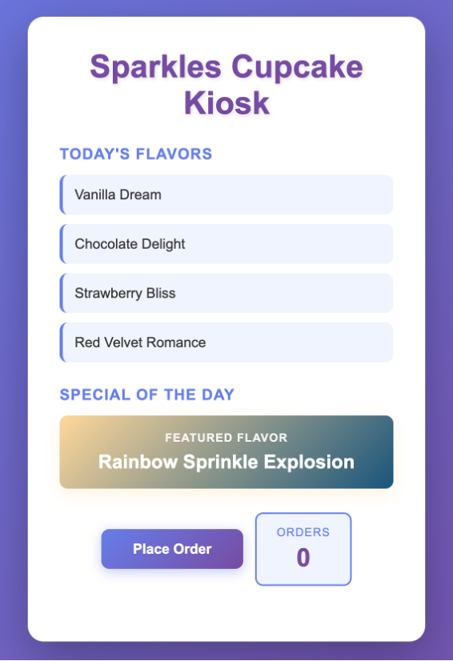

## Module 2.1: The agent that checks its own work (30 minutes)

**This is the one that matters.** An agent that runs for a minute needs a good
prompt. An agent that runs for an hour needs a way to tell whether it is still
on track, because nobody is watching each step. That is the whole difference
between a single call and an agent: something has to check the work and decide
whether to go again.

The pattern is always the same shape. Write down what "done" looks like before
starting. Build. Check the result against that, not against an opinion. Feed
the failures back and go again, until it passes or you run out of rounds.
Everything else in this lab — the toolbox, the tracing, the evaluations — hangs
off this loop.


One line of intent goes in on the left. The planner turns it into a spec: what
has to be true when the job is done, not how to build it. The generator builds
to that spec. The evaluator checks the result and answers PASS or FAIL with a
critique. FAIL sends the critique back to the generator and another round
starts. PASS ends the loop.

The example in the diagram is building the game 2048, and there the evaluator
opens the finished page in a browser to check that it actually plays. Yours is
a cupcake kiosk, and the checking is done by a script that reads the page and
counts what is on it. Same role, different evidence: nothing in the loop is
specific to what is being built, which is the point of it.

Three scripts, three roles, two Claude deployments:

- **planner.py**: one line of intent in, a testable spec out. Sonnet.
- **generator.py**: spec in, a single-file kiosk page out. Haiku, the faster
  and cheaper tier. It writes the most tokens by far, and it is working from a
  spec rather than judging anything.
- **evaluator.py**: the spec plus hard evidence in, PASS or FAIL out, with a
  critique. Sonnet, because the work is only ever as good as the judge.

Run each on its own first so you see what it produces, then run the loop.

```
cd sparkles-loop
```

### Step A: the planner (5 minutes)

**Open 'planner.py' before you run it.** Its job is to turn a request into a
list of things that can be checked without a person looking.

- **'PROMPT'** is the request: a kiosk page with today's flavors, a special,
  and a running order count. Clear to a human, but there is nothing in it a
  script could test.
- **'SPEC_SCHEMA'** makes the answer come back as fixed JSON rather than prose.
- **'SYSTEM'** tells Claude every acceptance criterion has to name a
  'data-testid' on the page. Those are the names the evaluator looks for
  later.

```
python planner.py
```

Read the spec it prints: three or four features, each with an acceptance
criterion, saved to 'workspace/spec.json'.

Every criterion hangs off a 'data-testid': a label attached to an element so a
script can find it without caring how the page looks. The spec always covers
these five:

| 'data-testid' | The element | What has to be true |
|---|---|---|
| 'title' | the shop name at the top | it is there |
| 'flavor-list' | today's flavors | it is there, and holds three flavors, each its own element |
| 'special' | the special of the day | it is there |
| 'order-btn' | the Place Order button | it is there |
| 'order-count' | the running count of orders | it is there |

That list is the contract for the rest of the module. The generator is told to
use exactly these names, 'checks.py' counts them, and the evaluator passes or
fails the page on them. It is also the same list the code evaluator scores in
Module 2.4.

### Step B: the generator, with a planted bug (5 minutes)

The generator writes the kiosk. It takes the spec the planner just produced
and returns a single HTML page for the shop counter: today's flavors, the
special, and a button that places an order. One file, no build step, nothing
to install.

**Open 'generator.py'.**

- **'SYSTEM'** is its entire brief: here is the spec, return one
  self-contained HTML file.
- It has no memory between sprints and never sees the evaluator's reasoning,
  only the critique text fed back in. That is what stops it grading its own
  work.
- **'seed()'** loads a first draft instead of generating one.

**The seed.** '--seed' loads 'seeds/kiosk_buggy.html', a page we wrote with two
mistakes in it. Open it in VS Code and find the two 'BUG' comments.

- **Only one flavor is listed.** The spec asks for three.
- **The order counter is missing.** The JavaScript tries to update an element
  called 'order-count' that was never added to the page. It checks the element
  exists first, so nothing breaks; the count just never appears.

In a browser the page looks finished. You would have to check it against the
spec to find either problem.

**Why start broken?** If the generator writes the first draft it might get it
right, and then there is no loop to watch. A page we know is wrong fails the
first round every time.

```
python generator.py --seed
```

That copies the page to 'workspace/index.html', which is what everything
downstream reads.

### Step C: evidence and the evaluator (10 minutes)

Something has to decide whether the page the generator produced actually meets
the spec. That happens in two parts: first a script measures the page, then
Claude decides whether those measurements are good enough.

**Open 'checks.py'.** No Claude here. It is ordinary Python that opens
'workspace/index.html' and counts what is on the page.

- **'evidence()'** reports which 'data-testid' names it found and how many
  items are in each list.
- Run it twice and you get the same answer twice. Ask the generator whether it
  built the page correctly and you get an opinion; this gives you a count.

```
python checks.py
```

The report lists which test ids exist, how many items each list has, and
whether the page pulls in any external scripts. Compare it with the spec from
Step A: the flavor list should have three items and it has one.

**Open 'evaluator.py'.** This is Claude again, in a fresh session, and it gets
two things: the spec, and the report you just ran.

- It never sees the HTML, and never sees what the generator said about its own
  work. A reviewer who reads the author's explanation first tends to agree with
  it.
- **'VERDICT_SCHEMA'** makes it answer PASS or FAIL with a written critique, in
  a fixed shape the loop can act on.

```
python evaluator.py
```

It should FAIL on the flavor list and the missing order counter, and write a
critique saying exactly what to change. That critique is what the generator
gets handed in the next step.

### Step D: the whole loop (10 minutes)

**Open 'run_loop.py'.** It is short, because the three scripts you just ran
do the work. This one decides what happens next.

- **'MAX_SPRINTS'** stops it after three rounds. Without a limit, a page the
  evaluator never accepts would loop forever.

```
python run_loop.py
```

Sprint 1 loads the seeded draft and fails. Sprint 2 hands the critique to the
generator, which rewrites the page. The evaluator checks again and passes.

**Now look at what it built.** Open 'workspace/index.html' in a browser.



- A flavor list with every flavor on its own row, instead of the single one
  the seed had. You may see more than three; the spec sets a floor, not a limit
- The special of the day, called out under it
- The order counter next to the button, showing 0
- Click **Place Order** and the count goes to 1

Open 'seeds/kiosk_buggy.html' alongside it to see where it started: one flavor,
and no counter at all.

**This is a mock, not a working till.** The button adds one to the number on
screen and does nothing else. There is no order sent anywhere, nothing saved,
and no connection to the MCP server or the real shop. What the loop has shown
is that it can build a page to a spec, catch its own mistake, and fix it
without anyone checking. A real kiosk would be the next job, and it would be
built the same way: write the spec first, then let the loop work to it.

> Why this matters. When an agent writes more code than you can review, the
> review becomes the bottleneck. The fix is not a better prompt for the
> writer; it is a separate judge with its own evidence. The loop is only
> ever as good as that judge, so that is where the effort goes.

**Checkpoint 8.** A planted bug caught by a Claude evaluator and fixed by a
Claude generator, with no human review.

> Try it: run 'python run_loop.py --fresh' to let the generator build the
> first draft itself instead of using the seed.
