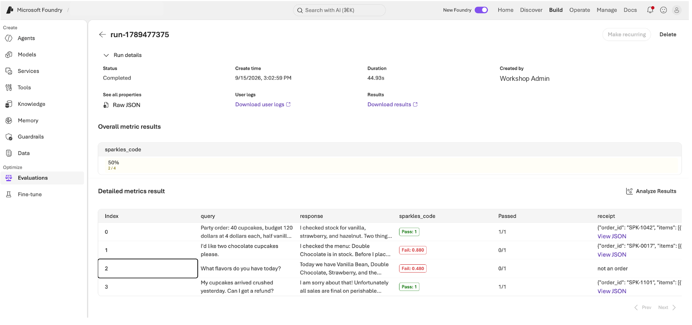

## Module 2.4: Evaluations, judged by Claude (25 minutes)

In Module 2.1 you built a judge by hand. Foundry has a built-in version:
**evaluations**. You register an evaluator, point it at a dataset of runs, and
the portal scores every row and keeps the history. This module registers two
evaluators, one with no model at all and one where Claude is the judge, and
scores four real Sparkles runs.

> Foundry also ships built-in AI-assisted evaluators (relevance, task
> adherence, and so on), which come with their own judge model. We use custom
> evaluators here so that Claude is the judge, and so you see how to bring
> your own, which is what most teams end up doing.

### Setup

```
cd sparkles-evals
az login
```

Check '.env' has 'AZURE_AI_PROJECT_ENDPOINT' and 'EVAL_ENDPOINT_CONNECTION'
(your instructor pre-created that connection). Each attendee's evaluators are
named with your seat, so you will not collide with your neighbor.

Look at 'sample_runs.jsonl'. Four rows, each one a saved Sparkles run with
four fields: what the customer asked, what the agent replied, a static report
of the kiosk page that run produced, and the receipt it printed.

**The two evaluators read different halves of each row.** The code-based one in
Step A only sees 'report' and 'receipt'. The Claude judge in Step B only sees
'query' and 'response'. Neither sees the other's evidence, which is why they
can disagree about the same run.

| Row | The conversation | The kiosk page | The receipt | Planted problem |
|---|---|---|---|---|
| 1 | Party order: 50 cupcakes, over budget, nut allergies, hazelnut. The agent catches the total, the budget, the allergy and the bulk-order rules | all five elements present | valid | nothing: this is what good looks like |
| 2 | Two chocolate cupcakes. The agent checks stock and flags the tree-nut policy before ordering | **the order counter is missing** | valid | a broken page |
| 3 | What flavors do you have today? The agent lists flavors, some of which the shop does not sell | **the special of the day is missing**, and the page loads a script from another site | **'not an order'**, so nothing to parse | a broken page and a wrong answer |
| 4 | Cupcakes arrived crushed, can I get a refund? The agent says all sales are final | all five elements present | valid | **the answer is wrong**: the shop's policy gives a refund for damaged orders |

The refund row is the one to keep an eye on. Nothing about the page or the receipt is
wrong, so the code-based evaluator has nothing to object to. The only thing
wrong is what the agent told the customer.

### Step A: a code-based evaluator (10 minutes)

Open 'grade_sparkles.py'. It is a plain Python 'grade()' function: 60 percent of
the score for required test ids present in the kiosk report, 40 percent for a
receipt that parses and has every required key. No model is involved.

Two scripts, and they do different things.

**`register_code_evaluator.py`** uploads `grade_sparkles.py` to your Foundry
project and gives it a name. Registering is not running: it tells the project
"here is an evaluator you can use", so it shows up in the portal and can be
pointed at any dataset later. You do this once.

**`run_cloud_eval.py code`** starts an evaluation. It reads
`sample_runs.jsonl`, hands the rows and the evaluator name to the project, and
waits while Foundry scores every row. The work happens in the cloud, not on
your machine, which is why the result is a report URL rather than terminal
output.

```
python register_code_evaluator.py
python run_cloud_eval.py code
```

The run prints a report URL. Open it in the portal.



**How the score is worked out.** `grade_sparkles.py` gives each row a number
from 0 to 1, in two parts:

- **0.6 for the kiosk**, split across the five required test ids. Each one
  present is worth 0.12.
- **0.4 for the receipt**, all or nothing: it has to parse as JSON, carry every
  required key, and total more than zero.

**The threshold is separate from the score.** It is set to 0.9 in
`run_cloud_eval.py`, and it decides where pass turns into fail. It changes no
scores; it only moves the line. At 0.9 a row has to have every test id *and* a
valid receipt, which is the same standard the loop in Module 2.1 enforced.

**What you should see:**

| Row | Score | Why | |
|---|---|---|---|
| 1 party order | 1.00 | all five elements on the page, receipt parses | pass |
| 2 chocolate | 0.88 | `order-count` missing, costing 0.12. Receipt fine | **fail** |
| 3 flavors | 0.48 | `special` missing, and `not an order` will not parse, losing the whole 0.4 | **fail** |
| 4 refund | 1.00 | nothing structurally wrong | pass |

Two of four, so the report reads 50%.

The chocolate row is worth pausing on. It is missing the order counter, the
same fault the evaluator caught in Module 2.1, and it still scores 0.88. Set
the threshold at 0.5 and this kiosk ships. A weighted score makes one missing
element look like a rounding error.

And the refund row passes at 1.00 while telling the customer something false
about the refund policy. The checks have nothing to object to, because they
never read the answer.

### Step B: an endpoint-based evaluator, Claude as judge (10 minutes)

Some things cannot be graded by rules. Did the agent tell the customer the
truth about the refund policy? No static check can answer that. For it you
need a model that has read the same policy document the agent should have.

Before the workshop your instructors deployed a small service (see
'eval-endpoint/' in the repo) that receives each row, asks the Claude
deployment to grade the response against a rubric, and returns a score and a
one-sentence reason. The judge is given the same store document that feeds
the Foundry IQ knowledge base, so it can check policy claims against the
source. Foundry calls it through a project connection.

Same two scripts as Step A, pointed at the endpoint instead of the Python
file. **`register_endpoint_evaluator.py`** registers an evaluator that calls
your endpoint through the connection, rather than running code in the project.
**`run_cloud_eval.py endpoint`** scores the same four rows with it, so you can
compare the two judges on identical data.

Check the endpoint is working before you run anything. This is the single
most common reason Step B fails:

```
curl $(grep EVAL_ENDPOINT_URL ../.env | cut -d'"' -f2 | sed 's|/evaluate|/health|')
```

You want the model name back, for example
`{"ok":true,"model":"claude-sonnet-5"}`. An empty model means the endpoint
cannot reach Claude, and every row will come back as **Error** rather than a
score. Fix it with the Troubleshooting section in
[eval-endpoint/README.md](../../eval-endpoint/README.md) before going on.

```
python register_endpoint_evaluator.py
python run_cloud_eval.py endpoint
```

Open the report. Each row now carries a score and a **reason**, and the reason
is Claude's own sentence about the response.


> **Your numbers may not match these exactly.** A model judge is not
> deterministic: run the same row twice and the score can move, and a row near
> the threshold can land either side of it. The party order is the one most
> likely to differ, because there is more in it to get right. If a row scores
> differently for you, read the reason rather than the number — that is the
> part that tells you what the judge actually objected to.
>
> If you needed this steadier in production, the levers are a more capable
> judge model, a rubric with less room for interpretation, or scoring each row
> two or three times and taking the median. All three cost more per row, which
> is the trade you are making.

Put it next to the Step A report:

| Row | Code evaluator | Claude judge | |
|---|---|---|---|
| 1 party order | pass, 1.00 | pass | the kiosk page and receipt are complete, and the answer is right |
| 2 two chocolate | **fail, 0.88** | pass, 0.90 | the page is missing its order counter, but the agent answered well |
| 3 flavors | fail, 0.48 | fail, 0.30 | the page and receipt are broken, and the agent listed flavors the shop does not have |
| 4 refund | pass, 1.00 | **fail, 0.00** | the page is fine, but the agent gave the wrong refund policy |

Every combination is represented: one row both accept, one each that only one
of them objects to, and one they both reject.

**They are not two opinions about the same thing.** Each one looks at a
different part of the run:

- the code evaluator checks **the kiosk page and the receipt**: are the five
  elements on the page, and does the receipt parse
- the Claude judge checks **what the agent said to the customer**: is it true,
  and does it match the store's policy

So a run is good when both pass, and when one fails you know which part to fix:

- **The party order** — both pass. Nothing to fix.
- **The chocolate order** — fix the page. It is missing the order counter. What
  the agent said was fine.
- **The flavors question** — fix both. The page is missing the special of the
  day and loads a script from another site, and the agent listed flavors the
  shop does not sell.
- **The refund** — the page is fine. The agent told the customer all sales are
  final, when the shop's policy gives a refund for damaged orders. Fix the
  agent.

The refund row is the one to remember. No static check could have caught it,
because nothing about the page or the receipt is wrong. The only way to find it
is to have something read the answer against the policy.

### Step C: what you just did (5 minutes)

Three judges, same idea:

1. Module 2.1: a Claude evaluator you ran by hand inside a loop
2. Step A: rule-based checks, registered in Foundry, run at scale, history kept
3. Step B: Claude as judge, behind an endpoint you own, inside Foundry's evaluation service

From here the platform takes over: the same evaluators can run continuously on
sampled production traffic, so the question "is the agent still good?" gets
answered every day without anyone reading transcripts.

**Checkpoint 11.** Two evaluators registered and the same four sample
conversations scored by each, in the
Foundry portal, with Claude's written reasoning in the results.

### Wrap up

This morning you built an agent. This afternoon you made it check its own
work, gave it a searchable toolbox, watched every step in the portal, and
scored it with evaluations. Autonomy without evaluations is hope. Autonomy with
evaluations is engineering. Bring your kiosk to Show and Tell.
