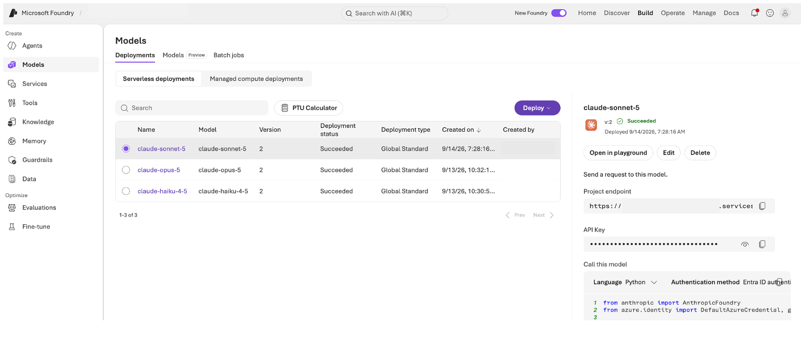
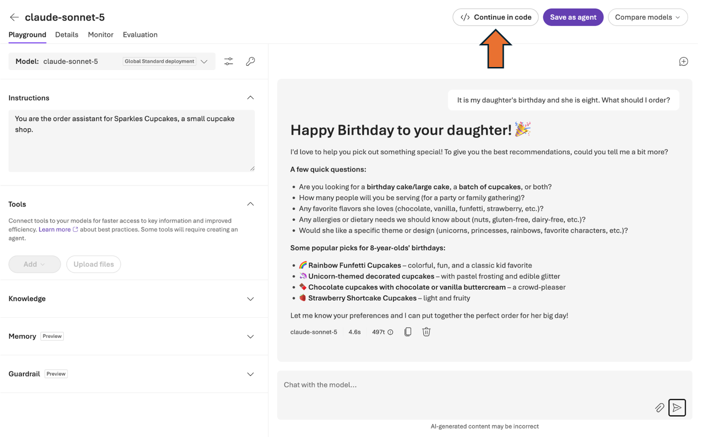

# Lab 1: Building an Agent with Claude on Microsoft Foundry

Welcome to Sparkles, the friendliest little cupcake shop on the internet.
Sparkles has more customers than staff, so today you will build the agent
that greets them, takes their orders, answers policy questions from the
shop's own documents, and reads their handwritten catering requests.

By the end of this lab you will have:

- Talked to Claude in the Foundry Playground and changed its behavior with one sentence
- Built a Python agent on Claude in Foundry
- Given it tools and a personality from the Cupcake Store MCP server, and ordered a real cupcake
- Connected the shop's knowledge base in Foundry IQ and watched Claude route between two tool servers
- Produced a schema-valid receipt with structured outputs
- Watched Claude read a handwritten order and place it, applying store policy
- Compared two Claude tiers on the same hard problem

**How the lab works.** Every module ends with a checkpoint. Modules 1.4 through
1.6 are independent, so if you fall behind, skip to the next one. Completed
code for every module is in 'sparkles-agent/snapshots/'; copy the one you
need over 'agent.py' and carry on.

**Your environment.** VS Code with the repo open, a terminal, and the Foundry
portal in a browser tab. Your settings live in the '.env' file at the top of
the repo, which you filled in when you worked through [SETUP.md](SETUP.md).

**Prerequisites**

- The Foundry project you created in [SETUP.md](SETUP.md), with both Claude deployments
- Python 3.10+ with the packages in 'requirements.txt'

---

## Module 1.0: Meet your model (10 minutes)

No code in this module. You will find Claude in Foundry, talk to it, and
change how it behaves with a system prompt.

### Sign in

1. Open [https://ai.azure.com](https://ai.azure.com) and sign in with the
   workshop account.
2. If the top bar has a **New Foundry** toggle, turn it on. The workshop
   project is pre-selected.


### Find the Claude deployment

1. In the left navigation choose **Build**, then **Models**.
2. Open the **Deployments** tab. You will see a Claude Sonnet deployment
   (the name matches 'FOUNDRY_MODEL_DEPLOYMENT' in your '.env') and a Claude
   Haiku deployment.



> **Model vs. deployment.** A model is what Anthropic ships. A deployment is
> your project's copy of it with a name, an endpoint, and quota. Your code
> always talks to the deployment name.

### Give it a role

Click the Sonnet deployment, then **Open in playground**. Find the
**Instructions** panel (the system prompt) and paste:

```
You are the order assistant for Sparkles Cupcakes, a small cupcake shop.
```

Then, in the chat box, ask: 'It is my daughter's birthday and she is eight.
What should I order?'

One sentence, and you have a shop assistant without having specified examples or formatting rules. 
In the code you write next, the same field is called 'instructions'.

### Find the edge

You will get back something like this:

```
Here are some ideas that are popular with kids her age:
  Vanilla with pink frosting, Chocolate with rainbow sprinkles, Funfetti
  Rainbow cupcakes - colorful inside, very magical!
  Unicorn cupcakes - super popular with 8-year-olds
  Strawberry with whipped frosting
```

However, none of these are actual Sparkles flavors! The model invented them.

You told it that it works at a cupcake shop. You did not tell it what the shop
sells, so it filled that in.

Now ask: 'What's your refund policy?'

You will get a reasonable-sounding policy, and it is invented too. Nothing you
told it says what Sparkles actually does. That is the real risk: not that the
model refuses, but that it answers confidently and plausibly with something
that is not your shop's policy.

Module 1.2 gives it the real menu. Module 1.3 gives it the real policies.

### Look at the code

Click the **Continue in code** button. This is the same call you will make from Python in the
next module. Note the three things it needs: the endpoint, a key, and the
deployment name.



**Checkpoint 1.** You have talked to Claude on Foundry, and seen what it does
and does not know about your shop.

---

## Module 1.1: Hello world agent (10 minutes)

Time to build the agent in Python. The framework you will use wraps a chat
model, a conversation session, and tools into one 'Agent' object.

### Check your settings

Open the '.env' file at the top of the repo in VS Code. It needs three
values, all from the Playground's **Details** tab:

```
FOUNDRY_ENDPOINT="https://<your-resource>.services.ai.azure.com/anthropic"
FOUNDRY_API_KEY="<key>"
FOUNDRY_MODEL_DEPLOYMENT="claude-sonnet-5"
```

You filled these in during [SETUP.md](SETUP.md) step 2. One thing to watch: the portal
shows the endpoint ending in '/v1/messages', but the value here must stop at
'/anthropic'. The client appends '/v1/messages' itself when it calls the API,
so leaving it on asks for '/anthropic/v1/messages/v1/messages', which 404s.


> Treat the key like a password. '.env' is in '.gitignore' so it never gets
> committed.

### Read the starting agent

Open 'sparkles-agent/agent.py'. It does four things:

```python-notype
# 2. The chat model: Claude on Microsoft Foundry
chat_client = AnthropicFoundryClient(
    model=os.environ["FOUNDRY_MODEL_DEPLOYMENT"],
    api_key=os.environ["FOUNDRY_API_KEY"],
    base_url=os.environ["FOUNDRY_ENDPOINT"],
)

# 3. The agent
agent = Agent(client=chat_client, name="cupcake-agent")

# 4. A session keeps the conversation history
session = agent.create_session()
```

Then a loop reads what you type, calls 'agent.run(...)', and prints the reply.

### Run it

In the terminal:

```
cd sparkles-agent
python agent.py
```

Type 'Hello!' and you should get a friendly reply. Type 'exit' to stop.

**Checkpoint 2.** A terminal conversation with your own agent.

If it fails: a '401' means the key or endpoint is wrong; 'DeploymentNotFound'
means the deployment name does not match the portal exactly.

---

## Module 1.2: Tools and a personality (15 minutes)

An agent that only chats cannot take an order. To check stock and place
orders it needs **tools**, and to sound like Sparkles it needs a persona.
Both come from the Cupcake Store **MCP server**.

> **What is MCP?** The Model Context Protocol is an open standard for
> connecting agents to external systems. An MCP server publishes tools
> (functions), prompts (reusable instructions), and resources over HTTP. Your
> agent only needs the URL; the framework discovers everything else.

### Step A: give it tools

Two changes to 'agent.py': import 'MCPStreamableHTTPTool', point it at the
server and connect, then pass it to the 'Agent' via 'tools='. Make the edits
marked 👈 1.2A in the box below.

```python-notype
"""Sparkles - The Cupcake ordering agent"""

import asyncio
import os

from dotenv import load_dotenv

from agent_framework import Agent, MCPStreamableHTTPTool          # 👈 1.2A
from agent_framework.foundry import AnthropicFoundryClient

# 1. Load settings from .env
load_dotenv()


def reply(response) -> str:
    """Sparkles' words, with a blank line between what it says before a tool
    call and its answer after (response.text runs them together)."""
    return "\n\n".join(m.text for m in response.messages if m.text)


async def main() -> None:
    # 2. The chat model: Claude on Microsoft Foundry
    chat_client = AnthropicFoundryClient(
        model=os.environ["FOUNDRY_MODEL_DEPLOYMENT"],
        api_key=os.environ["FOUNDRY_API_KEY"],
        base_url=os.environ["FOUNDRY_ENDPOINT"],
    )

    # 3. Connect to the Cupcake Store MCP server                    👈 1.2A
    mcp_tool = MCPStreamableHTTPTool(
        name="cupcake-store",
        url=os.environ["CUPCAKE_MCP_URL"],
    )
    await mcp_tool.connect()

    # 4. The agent, now with tools
    agent = Agent(
        client=chat_client,
        name="cupcake-agent",
        tools=mcp_tool,                                            # 👈 1.2A
    )

    # 5. A session keeps the conversation history
    session = agent.create_session()
    print("Sparkles agent ready. Type 'exit' to quit.\n")

    while True:
        user_input = input("\033[1;35mYou:\033[0m\n")
        if user_input.lower() in ("exit", "quit"):
            break
        if not user_input.strip():
            continue
        response = await agent.run(user_input, session=session)
        print(f"\n\033[1;35mSparkles:\033[0m\n{reply(response)}\n")

    await mcp_tool.close()                                         # 👈 1.2A


if __name__ == "__main__":
    asyncio.run(main())
```

You can also just replace the file contents with everything in the box.

Save the file, then run it:

```
python agent.py
```

Ask: 'What flavors do you have today?' The agent decides on its own to call
the store's tools, and answers from live stock.

**Do not order a cupcake yet.** This step is only to prove the tools work.
Notice the voice: it has the shop's tools, but it still sounds like a generic
assistant. Type 'exit' when you are done.

### Step B: give it a personality

The shop has opinions about how its agent should behave, and it does not want
every developer pasting the latest persona into their code. So the persona
lives on the **server**, not in your repo.

MCP servers can publish **prompts**: reusable text the server owner curates.
When the persona changes, the server updates and your code keeps working. The
Cupcake Store publishes two:

- **agent_instructions**, the persona
- **welcome_banner**, a greeting to print at startup

Fetch both, pass the instructions to the 'Agent', and print the banner before
the chat starts. Make the edits marked 👈 1.2B in the box below.

```python-notype
"""Sparkles - The Cupcake ordering agent (completed through Module 1.2)"""

import asyncio
import os

from dotenv import load_dotenv

from agent_framework import Agent, MCPStreamableHTTPTool
from agent_framework.foundry import AnthropicFoundryClient

# 1. Load settings from .env
load_dotenv()


def reply(response) -> str:
    """Sparkles' words, with a blank line between what it says before a tool
    call and its answer after (response.text runs them together)."""
    return "\n\n".join(m.text for m in response.messages if m.text)


async def main() -> None:
    # 2. The chat model: Claude on Microsoft Foundry
    chat_client = AnthropicFoundryClient(
        model=os.environ["FOUNDRY_MODEL_DEPLOYMENT"],
        api_key=os.environ["FOUNDRY_API_KEY"],
        base_url=os.environ["FOUNDRY_ENDPOINT"],
    )

    # 3. Connect to the Cupcake Store MCP server
    mcp_tool = MCPStreamableHTTPTool(
        name="cupcake-store",
        url=os.environ["CUPCAKE_MCP_URL"],
    )
    await mcp_tool.connect()

    # 4. Persona and welcome banner come from the MCP server        👈 1.2B
    instructions = await mcp_tool.get_prompt("agent_instructions")
    banner = await mcp_tool.get_prompt("welcome_banner")

    # 5. The agent, now with tools and a personality
    agent = Agent(
        client=chat_client,
        name="cupcake-agent",
        instructions=instructions,                                 # 👈 1.2B
        tools=mcp_tool,
    )

    # 6. A session keeps the conversation history
    session = agent.create_session()
    print(banner)                                                  # 👈 1.2B
    print("Type 'exit' to quit.\n")

    # Let Sparkles greet the customer first                        👈 1.2B
    response = await agent.run("hello", session=session)
    print(f"\033[1;35mSparkles:\033[0m\n{reply(response)}\n")

    while True:
        user_input = input("\033[1;35mYou:\033[0m\n")
        if user_input.lower() in ("exit", "quit"):
            break
        if not user_input.strip():
            continue
        response = await agent.run(user_input, session=session)
        print(f"\n\033[1;35mSparkles:\033[0m\n{reply(response)}\n")

    await mcp_tool.close()


if __name__ == "__main__":
    asyncio.run(main())
```

You can also just replace the file contents with everything in the box.

### Run it and order a cupcake

```
python agent.py
```

This time Sparkles greets you first, in the shop's own voice. Same model,
same tools, same code as Step A apart from four lines: the personality came
from the server, not from your repo.

Now order a cupcake. Answer its questions, pick a flavor, and place the order.

> **Write down your customer ID.** Sparkles gives you an eight-character ID
> like 'ABCD2345' the first time you order. You will need it later.

Watch it arrive on the order dashboard: the address in 'CUPCAKE_MCP_URL' with
'/dashboard' in place of '/mcp/'. When your order shows **ready**, it is done.


**Checkpoint 3.** An end-to-end order through your own agent, and a real
cupcake.

---

## Module 1.3: Give it knowledge with Foundry IQ (10 minutes)

### Find the gap

Run your agent and ask two questions:

1. 'What flavors do you have today?' It answers, calling the store's tools.
2. 'Do you bake with tree nuts?' It cannot, and says so.

Same agent, same session. One question served, one not. It has tools; they
just do not cover policy. The shop's policies live in a document, and this
module gives the agent that document through **Foundry IQ**.

> **What is Foundry IQ?** The managed knowledge layer in Microsoft Foundry,
> built on Azure AI Search. In [SETUP.md](SETUP.md) you loaded the Sparkles store
> information (hours, delivery, returns, allergens, loyalty, bulk-order rules)
> into a knowledge base. Every Foundry IQ knowledge base exposes an **MCP
> endpoint**, so to your agent it is just another tool server, the same kind
> you connected in Module 1.2.

### Add the knowledge base

Your '.env' already has three lines for it:

```
AZURE_SEARCH_ENDPOINT="https://<service>.search.windows.net"
AZURE_SEARCH_QUERY_KEY="<query key>"
KNOWLEDGE_BASE_NAME="cupcake-store-kb"
```

A second MCP tool, pointed at the knowledge base's MCP endpoint with the
Search key in a header. Make the edits marked 👈 1.3 in the box below.

```python-notype
"""Sparkles - The Cupcake ordering agent"""

import asyncio
import os

from dotenv import load_dotenv

from agent_framework import Agent, MCPStreamableHTTPTool
from agent_framework.foundry import AnthropicFoundryClient

# 1. Load settings from .env
load_dotenv()


def reply(response) -> str:
    """Sparkles' words, with a blank line between what it says before a tool
    call and its answer after (response.text runs them together)."""
    return "\n\n".join(m.text for m in response.messages if m.text)


async def main() -> None:
    # 2. The chat model: Claude on Microsoft Foundry
    chat_client = AnthropicFoundryClient(
        model=os.environ["FOUNDRY_MODEL_DEPLOYMENT"],
        api_key=os.environ["FOUNDRY_API_KEY"],
        base_url=os.environ["FOUNDRY_ENDPOINT"],
    )

    # 3. Connect to the Cupcake Store MCP server (orders, stock)
    mcp_tool = MCPStreamableHTTPTool(
        name="cupcake-store",
        url=os.environ["CUPCAKE_MCP_URL"],
    )
    await mcp_tool.connect()

    # 4. Connect to the shop's knowledge base in Foundry IQ (policies)   👈 1.3
    search_endpoint = os.environ["AZURE_SEARCH_ENDPOINT"].rstrip("/")
    search_key = os.environ["AZURE_SEARCH_QUERY_KEY"]
    kb_name = os.environ.get("KNOWLEDGE_BASE_NAME", "cupcake-store-kb")
    knowledge_tool = MCPStreamableHTTPTool(
        name="cupcake-knowledge-base",
        url=f"{search_endpoint}/knowledgebases/{kb_name}/mcp?api-version=2026-08-01-preview",
        header_provider=lambda _: {"api-key": search_key},
        load_prompts=False,
    )
    await knowledge_tool.connect()

    # 5. Persona and welcome banner come from the MCP server
    instructions = await mcp_tool.get_prompt("agent_instructions")
    banner = await mcp_tool.get_prompt("welcome_banner")
    instructions += (                                              # 👈 1.3
        "\n\nUse the cupcake-store tool for orders, stock, and order status. "
        "Use the cupcake-knowledge-base tool for store policies: hours, "
        "delivery, shipping, returns, allergens, loyalty, and bulk orders. "
        "Do not invent store information; look it up."
    )

    # 6. The agent, now with two tool servers and a personality
    agent = Agent(
        client=chat_client,
        name="cupcake-agent",
        instructions=instructions,
        tools=[mcp_tool, knowledge_tool],                           # 👈 1.3
    )

    # 7. A session keeps the conversation history
    session = agent.create_session()
    print(banner)
    print("Type 'exit' to quit.\n")

    response = await agent.run("hello", session=session)
    print(f"\033[1;35mSparkles:\033[0m\n{reply(response)}\n")

    while True:
        user_input = input("\033[1;35mYou:\033[0m\n")
        if user_input.lower() in ("exit", "quit"):
            break
        if not user_input.strip():
            continue
        response = await agent.run(user_input, session=session)
        print(f"\n\033[1;35mSparkles:\033[0m\n{reply(response)}\n")

    await knowledge_tool.close()                                    # 👈 1.3
    await mcp_tool.close()


if __name__ == "__main__":
    asyncio.run(main())
```

You can also just replace the file contents with everything in the box.

### Watch it choose

Run 'python agent.py' and ask, in this order:

1. 'Do you bake with tree nuts?'
2. 'What flavors do you have today?'
3. 'My order arrived squashed. What can I do?'
4. 'I need 30 cupcakes for a party on Saturday. Anything I should know?'

Question 1 is the one it could not answer a few minutes ago. Questions 1, 3,
and 4 go to the knowledge base; question 2 goes to the store.
Nothing in your code routes them. Claude reads the two tools' descriptions
and decides per question. Question 4 should turn up the bulk-order rules
(72 hours notice, 50 percent deposit); remember that for Module 1.6.

**Checkpoint 4.** Your agent answers policy questions from the shop's own
document, and picks the right server without being told.

> Where this goes in real life: swap the store document for your product
> docs, your support runbook, or your contracts, and the agent pattern is
> the same.

---

## Module 1.4: A receipt you can trust (10 minutes)

Sparkles' back office needs every order as clean JSON, every time. That used to
mean asking the model nicely and parsing whatever came back. Claude on Foundry
supports **structured outputs**: you give the API a JSON schema and the
response is guaranteed to match it.

### The schema

Open 'sparkles-agent/receipt.py'. The schema describes a receipt: order id,
items (flavor and quantity), total in cents, pickup time. Two things to
notice:

- The call passes the schema in 'output_config':
- The answer is not always the first content block. Claude may return a
  thinking block first, so 'first_text()' picks the first block of type
  'text' rather than reaching for 'content[0]'.

```python-notype
r = client.messages.create(
    model=os.environ["FOUNDRY_MODEL_DEPLOYMENT"],
    max_tokens=500,
    output_config={"format": {"type": "json_schema", "schema": RECEIPT_SCHEMA}},
    messages=[{"role": "user", "content": "Produce the receipt for ... " + order_text}],
)
return json.loads(first_text(r))
```

Try it on its own first:

```
python receipt.py
```

You get a receipt object that validates against the schema. Run it a few
times; it never drifts.

### Wire it into the agent

Add a 'receipt' command to 'agent.py'. The agent has to remember its last
reply, so there are two 'last_reply' assignments: one after the opening
greeting and one inside the loop. Make the edits marked 👈 1.4 in the box
below.

```python-notype
"""Sparkles - The Cupcake ordering agent"""

import asyncio
import json                                                        # 👈 1.4
import os

from dotenv import load_dotenv

from agent_framework import Agent, MCPStreamableHTTPTool
from agent_framework.foundry import AnthropicFoundryClient

from receipt import make_receipt                                   # 👈 1.4

# 1. Load settings from .env
load_dotenv()


def reply(response) -> str:
    """Sparkles' words, with a blank line between what it says before a tool
    call and its answer after (response.text runs them together)."""
    return "\n\n".join(m.text for m in response.messages if m.text)


async def main() -> None:
    # 2. The chat model: Claude on Microsoft Foundry
    chat_client = AnthropicFoundryClient(
        model=os.environ["FOUNDRY_MODEL_DEPLOYMENT"],
        api_key=os.environ["FOUNDRY_API_KEY"],
        base_url=os.environ["FOUNDRY_ENDPOINT"],
    )

    # 3. Connect to the Cupcake Store MCP server (orders, stock)
    mcp_tool = MCPStreamableHTTPTool(
        name="cupcake-store",
        url=os.environ["CUPCAKE_MCP_URL"],
    )
    await mcp_tool.connect()

    # 4. Connect to the shop's knowledge base in Foundry IQ (policies)
    search_endpoint = os.environ["AZURE_SEARCH_ENDPOINT"].rstrip("/")
    search_key = os.environ["AZURE_SEARCH_QUERY_KEY"]
    kb_name = os.environ.get("KNOWLEDGE_BASE_NAME", "cupcake-store-kb")
    knowledge_tool = MCPStreamableHTTPTool(
        name="cupcake-knowledge-base",
        url=f"{search_endpoint}/knowledgebases/{kb_name}/mcp?api-version=2026-08-01-preview",
        header_provider=lambda _: {"api-key": search_key},
        load_prompts=False,
    )
    await knowledge_tool.connect()

    # 5. Persona and welcome banner come from the MCP server
    instructions = await mcp_tool.get_prompt("agent_instructions")
    banner = await mcp_tool.get_prompt("welcome_banner")
    instructions += (
        "\n\nUse the cupcake-store tool for orders, stock, and order status. "
        "Use the cupcake-knowledge-base tool for store policies: hours, "
        "delivery, shipping, returns, allergens, loyalty, and bulk orders. "
        "Do not invent store information; look it up."
    )

    # 6. The agent, with two tool servers and a personality
    agent = Agent(
        client=chat_client,
        name="cupcake-agent",
        instructions=instructions,
        tools=[mcp_tool, knowledge_tool],
    )

    # 7. A session keeps the conversation history
    session = agent.create_session()
    print(banner)
    print("Type 'exit' to quit, or 'receipt' after ordering.\n")   # 👈 1.4

    response = await agent.run("hello", session=session)
    print(f"\033[1;35mSparkles:\033[0m\n{reply(response)}\n")
    last_reply = reply(response)                                   # 👈 1.4

    while True:
        user_input = input("\033[1;35mYou:\033[0m\n")
        if user_input.lower() in ("exit", "quit"):
            break
        if not user_input.strip():
            continue

        if user_input.lower() == "receipt":                        # 👈 1.4
            receipt = make_receipt(last_reply)
            print("\n\033[1;32mReceipt (schema-valid):\033[0m")
            print(json.dumps(receipt, indent=2), "\n")
            continue

        response = await agent.run(user_input, session=session)
        last_reply = reply(response)                               # 👈 1.4
        print(f"\n\033[1;35mSparkles:\033[0m\n{reply(response)}\n")

    await knowledge_tool.close()
    await mcp_tool.close()


if __name__ == "__main__":
    asyncio.run(main())
```

You can also just replace the file contents with everything in the box.

Run the agent, place an order, then type 'receipt'.

**Checkpoint 5.** A schema-valid receipt from a real order, on every run.

---

## Module 1.5: Claude can see: the catering order (15 minutes)

A catering order just arrived as a photo of a handwritten note. One item is
crossed out with a replacement scribbled next to it, quantities are tally
marks, and there is an allergy note in the margin. Nothing on it is
machine-readable. This module shows what Claude does with it.

### Write the order

You are making the note yourself. Write it by hand on paper, photograph it
slightly askew in normal light, and save it as
'sparkles-agent/images/catering-order.jpg'.

It needs all of these, because the agent is checked on each one:

- A customer name at the top
- Three or four flavor lines, quantities written as tally marks. Use the exact
  names from the store's menu; ask your agent 'What flavors do you have today?'
- One line crossed out, with the replacement written beside it
- An allergy note in the margin. 'NO NUTS!!' works well
- One line with a quantity of 25 or more, so the bulk-order policy applies

Read it back yourself before you run anything. You will be checking that
Claude honors the correction and the allergy note.

> **Short on time?** A note already ships with the repo at
> 'sparkles-agent/images/catering-order.jpg'. Open it, read it, and carry on
> from the next section. Writing your own is the better version though: you
> choose what to cross out and what to put in the margin, so you find out what
> Claude does with your handwriting rather than ours.

### How the script works

Open 'sparkles-agent/catering.py'. It chains everything you have built so
far, plus vision:

1. **Vision + structured outputs.** The photo goes to Claude as an image
   block, and the response is forced into an order schema (customer, items,
   allergy notes, corrections applied). This is the part no regex could do.
2. **The agent works the order.** The clean order goes to the Sparkles agent
   with both tool servers from Module 1.3 and a short brief. The counter
   takes one cupcake per customer, so a catering order can never be placed in
   full at the counter. The agent looks up the allergen and catering policy
   in the knowledge base, checks the menu, flags anything that conflicts with
   the allergy note, places **one test order** for the first item that is
   available and safe, and spells out what the catering team must handle and
   what the customer needs to do (notice period, deposit).
3. **The receipt** from Module 1.4, for the whole catering order.

The image is sent like this:

```python-notype
{"type": "image", "source": {"type": "base64", "media_type": media_type, "data": data}},
{"type": "text", "text": "This is a handwritten catering order ... Crossed-out items are cancelled ..."}
```

### Run it

Have two things ready: your customer ID from Module 1.2, and the voucher code
on the order dashboard.

```
python catering.py images/catering-order.jpg
```

The agent reads the photo, then asks you for what it needs to place the test
order. Answer it (for example 'My customer ID is ABCD2345, voucher 4KQ7ZP'),
then type 'done' to print the receipt.

Check the output against the photo:

- Did the crossed-out item disappear and the replacement appear?
- Are the tally-mark quantities right?
- Is the allergy note captured, and did the agent quote the shop's allergen
  policy (the facility processes tree nuts) rather than guessing?
- Did it explain the catering rules from the knowledge base (72 hours notice,
  50 percent deposit for 25 or more)?
- Does the receipt list every item on the photo?

**Checkpoint 6.** The photo read correctly, the shop's own policy applied,
one safe test order placed, and a receipt for the whole catering order. No
parser could have read the note.

---

## Module 1.6: Model judgment and tiering (10 minutes)

No new code. This module is about what the model does when an order does not
add up.

### The hard order

Run your agent ('python agent.py'). Fill in your customer ID from Module 1.2
and the voucher code on the order dashboard, then paste this. It is one long
line on purpose: the agent reads a line at a time, so a prompt split across
several lines arrives as several separate messages.

```
My customer ID is <your ID>. One hazelnut cupcake please, as a test order. I'm allergic to nuts. If hazelnut is gone, get me two red velvets instead. Voucher code: <code on the dashboard>. Also, my friend wants 30 cupcakes for a party in two days. What do we need to do?
```

There are four problems hidden in that request. One comes from the store's
live data, three from the shop's policy document:

- Hazelnut is sold out, so it is not on the menu.
- Hazelnut would be unsafe for a nut allergy even if it were in stock.
- Thirty cupcakes is a bulk order: the knowledge base says 72 hours notice
  and a 50 percent deposit.
- Two days is 48 hours, which does not meet the 72 hour requirement.

Watch what Claude does. It should check the menu, catch as many of the four
as it can, and look up the catering rules instead of assuming them.

One more thing to watch, which is not a problem to catch: the order says to
substitute red velvet if hazelnut is gone. Does it apply that fallback, or stop
and ask first? Either is defensible. What you are looking for is whether it
noticed the instruction at all. Type 'exit' when you are done.

### Same code, different tier

Now run the same order on Claude Haiku, the fast and inexpensive tier. No
code changes; only the deployment name:

```
FOUNDRY_MODEL_DEPLOYMENT=claude-haiku-4-5 python agent.py
```

(On Windows PowerShell: '$env:FOUNDRY_MODEL_DEPLOYMENT="claude-haiku-4-5"; python agent.py')

Paste the same order, with the new voucher code from the dashboard. Compare
speed, count how many of the four problems each tier catches, and note
whether it consulted the knowledge base for the party question.

> Foundry hosts several Claude tiers behind the same API. Routing simple
> traffic to Haiku and hard judgment calls to Sonnet is a one-line change,
> which is exactly what you just did.

**Checkpoint 7.** The same code on two tiers with a visible difference in
judgment.

### Wrap up

You built a Claude agent on Foundry, gave it tools, a persona, and the shop's
own knowledge, made its output schema-safe, had it read handwriting and apply
policy, and compared tiers. After lunch, Lab 2 takes the next step: an agent
that verifies its own work, and the Foundry features that let you run it
unattended.


