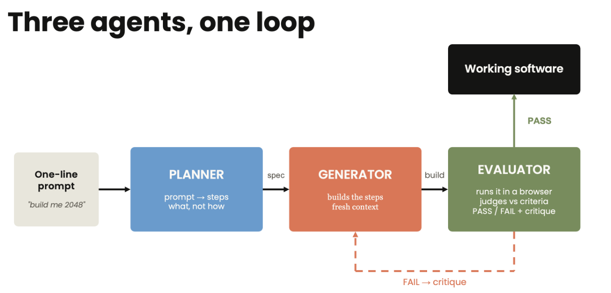
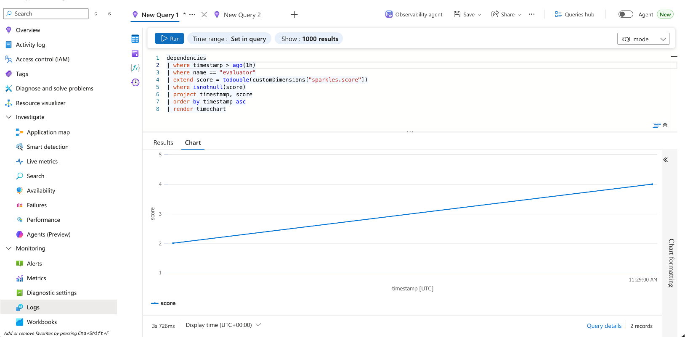

# Lab 2: Making Your Agent Work over a Long Horizon

This morning you built the Sparkles agent and watched it every step of the
way. This afternoon the shop wants software built with nobody watching, and
then it wants to know whether it can trust what came out.

The job: Sparkles needs an ordering kiosk page for the counter. You will run
a loop where one Claude plans it, another builds it, and a third judges the
result and sends it back until it passes. Then you will use Foundry to run
that pattern properly: a searchable tool catalog, traces of every step, and
evaluations where Claude is the judge.

By the end of this lab you will have:

- Run a planner, generator, and evaluator loop that catches a planted bug and fixes it
- Grounded the plan in web search and let Claude find tools by searching a catalog
- Seen every model call, token count, and latency in the Foundry portal
- Registered evaluators and scored real runs in Foundry, with Claude's written reasoning in the results

**How the lab works.** Everything runs from scripts already in
'sparkles-loop/' and 'sparkles-evals/'. You read them, run them, and change
what they do. Each module ends with a checkpoint.

**If you are picking this up fresh**, copy
'sparkles-agent/snapshots/agent-module-1.4.py' over 'agent.py' and check that
'.env' is still filled in. Everyone else starts at Module 2.1.

**Idea that runs through the afternoon:** the agent that writes is not the
agent that judges. You will meet that idea three times, at three levels of
polish.

---

## Module 2.1: The agent that checks its own work (30 minutes)

**This is the one that matters.** An agent that runs for a minute needs a good
prompt. An agent that runs for an hour needs a way to tell whether it is still
on track, because nobody is watching each step. That is the whole difference
between a single call and an agent: something has to check the work and decide
whether to go again.

The pattern is always the same shape. Write down what "done" looks like before
starting. Build. Check the result against that, not against an opinion. Feed
the failures back and go again, until it passes or you run out of rounds.
Everything else in this lab — the toolbox, the tracing, the evaluations — hangs
off this loop.



One line of intent goes in on the left. The planner turns it into a spec: what
has to be true when the job is done, not how to build it. The generator builds
to that spec. The evaluator checks the result and answers PASS or FAIL with a
critique. FAIL sends the critique back to the generator and another round
starts. PASS ends the loop.

The example in the diagram is building the game 2048, and there the evaluator
opens the finished page in a browser to check that it actually plays. Yours is
a cupcake kiosk, and the checking is done by a script that reads the page and
counts what is on it. Same role, different evidence: nothing in the loop is
specific to what is being built, which is the point of it.

Three scripts, three roles, two Claude deployments:

- **planner.py**: one line of intent in, a testable spec out. Sonnet.
- **generator.py**: spec in, a single-file kiosk page out. Haiku, the faster
  and cheaper tier. It writes the most tokens by far, and it is working from a
  spec rather than judging anything.
- **evaluator.py**: the spec plus hard evidence in, PASS or FAIL out, with a
  critique. Sonnet, because the work is only ever as good as the judge.

Run each on its own first so you see what it produces, then run the loop.

```
cd sparkles-loop
```

### Step A: the planner (5 minutes)

**Open 'planner.py' before you run it.** Its job is to turn a request into a
list of things that can be checked without a person looking.

- **'PROMPT'** is the request: a kiosk page with today's flavors, a special,
  and a running order count. Clear to a human, but there is nothing in it a
  script could test.
- **'SPEC_SCHEMA'** makes the answer come back as fixed JSON rather than prose.
- **'SYSTEM'** tells Claude every acceptance criterion has to name a
  'data-testid' on the page. Those are the names the evaluator looks for
  later.

```
python planner.py
```

Read the spec it prints: three or four features, each with an acceptance
criterion, saved to 'workspace/spec.json'.

Every criterion hangs off a 'data-testid': a label attached to an element so a
script can find it without caring how the page looks. The spec always covers
these five:

| 'data-testid' | The element | What has to be true |
|---|---|---|
| 'title' | the shop name at the top | it is there |
| 'flavor-list' | today's flavors | it is there, and holds three flavors, each its own element |
| 'special' | the special of the day | it is there |
| 'order-btn' | the Place Order button | it is there |
| 'order-count' | the running count of orders | it is there |

That list is the contract for the rest of the module. The generator is told to
use exactly these names, 'checks.py' counts them, and the evaluator passes or
fails the page on them. It is also the same list the code evaluator scores in
Module 2.4.

### Step B: the generator, with a planted bug (5 minutes)

The generator writes the kiosk. It takes the spec the planner just produced
and returns a single HTML page for the shop counter: today's flavors, the
special, and a button that places an order. One file, no build step, nothing
to install.

**Open 'generator.py'.**

- **'SYSTEM'** is its entire brief: here is the spec, return one
  self-contained HTML file.
- It has no memory between sprints and never sees the evaluator's reasoning,
  only the critique text fed back in. That is what stops it grading its own
  work.
- **'seed()'** loads a first draft instead of generating one.

**The seed.** '--seed' loads 'seeds/kiosk_buggy.html', a page we wrote with two
mistakes in it. Open it in VS Code and find the two 'BUG' comments.

- **Only one flavor is listed.** The spec asks for three.
- **The order counter is missing.** The JavaScript tries to update an element
  called 'order-count' that was never added to the page. It checks the element
  exists first, so nothing breaks; the count just never appears.

In a browser the page looks finished. You would have to check it against the
spec to find either problem.

**Why start broken?** If the generator writes the first draft it might get it
right, and then there is no loop to watch. A page we know is wrong fails the
first round every time.

```
python generator.py --seed
```

That copies the page to 'workspace/index.html', which is what everything
downstream reads.

### Step C: evidence and the evaluator (10 minutes)

Something has to decide whether the page the generator produced actually meets
the spec. That happens in two parts: first a script measures the page, then
Claude decides whether those measurements are good enough.

**Open 'checks.py'.** No Claude here. It is ordinary Python that opens
'workspace/index.html' and counts what is on the page.

- **'evidence()'** reports which 'data-testid' names it found and how many
  items are in each list.
- Run it twice and you get the same answer twice. Ask the generator whether it
  built the page correctly and you get an opinion; this gives you a count.

```
python checks.py
```

The report lists which test ids exist, how many items each list has, and
whether the page pulls in any external scripts. Compare it with the spec from
Step A: the flavor list should have three items and it has one.

**Open 'evaluator.py'.** This is Claude again, in a fresh session, and it gets
two things: the spec, and the report you just ran.

- It never sees the HTML, and never sees what the generator said about its own
  work. A reviewer who reads the author's explanation first tends to agree with
  it.
- **'VERDICT_SCHEMA'** makes it answer PASS or FAIL with a written critique, in
  a fixed shape the loop can act on.

```
python evaluator.py
```

It should FAIL on the flavor list and the missing order counter, and write a
critique saying exactly what to change. That critique is what the generator
gets handed in the next step.

### Step D: the whole loop (10 minutes)

**Open 'run_loop.py'.** It is short, because the three scripts you just ran
do the work. This one decides what happens next.

- **'MAX_SPRINTS'** stops it after three rounds. Without a limit, a page the
  evaluator never accepts would loop forever.

```
python run_loop.py
```

Sprint 1 loads the seeded draft and fails. Sprint 2 hands the critique to the
generator, which rewrites the page. The evaluator checks again and passes.

**Now look at what it built.** Open 'workspace/index.html' in a browser.


- A flavor list with every flavor on its own row, instead of the single one
  the seed had. You may see more than three; the spec sets a floor, not a limit
- The special of the day, called out under it
- The order counter next to the button, showing 0
- Click **Place Order** and the count goes to 1

Open 'seeds/kiosk_buggy.html' alongside it to see where it started: one flavor,
and no counter at all.

**This is a mock, not a working till.** The button adds one to the number on
screen and does nothing else. There is no order sent anywhere, nothing saved,
and no connection to the MCP server or the real shop. What the loop has shown
is that it can build a page to a spec, catch its own mistake, and fix it
without anyone checking. A real kiosk would be the next job, and it would be
built the same way: write the spec first, then let the loop work to it.

> Why this matters. When an agent writes more code than you can review, the
> review becomes the bottleneck. The fix is not a better prompt for the
> writer; it is a separate judge with its own evidence. The loop is only
> ever as good as that judge, so that is where the effort goes.

**Checkpoint 8.** A planted bug caught by a Claude evaluator and fixed by a
Claude generator, with no human review.

> Try it: run 'python run_loop.py --fresh' to let the generator build the
> first draft itself instead of using the seed.

---

## Module 2.2: Fresh research and a bigger toolbox (15 minutes)

Two more Claude on Foundry capabilities make the loop smarter without
changing its shape.

### Fresh knowledge: web search

This morning the agent learned what the shop knows (Foundry IQ). Now it
learns what the world knows. **Web search** is built into Claude on Foundry.

**Open 'websearch.py' first.** 'QUESTION' is what gets asked, and you can edit
it. Claude runs the searches and reads the results on the server side, so your
script never fetches a web page itself.

```
python websearch.py
```

Claude searches, reads a few results, and recommends a special with sources
listed at the bottom. Compare with your neighbor: see if anyone gets something
different.

### Research before planning

Now let the planner do the same before it writes the spec:

```
python planner.py --research
```

The research notes print first, then the spec. The flavors and the special
now come from live results, so your kiosk will not match your neighbor's.
'python run_loop.py --research' does the same inside the full loop.

### Tool search

Sparkles' tool catalog keeps growing. Loading every tool into every request
costs context and confuses the model. With **tool search**, tools are marked
'defer_loading' and Claude searches for the ones it needs:

**Open 'toolsearch.py'** and look at **'CATALOG'**: twelve tools, each with a
name and a one-line description.

- Sending all twelve with every request uses context and gives the model more
  wrong options to pick from.
- **'defer_loading'** holds them back. Claude searches the descriptions and
  loads only the tools the question needs.

```
python toolsearch.py "How many loyalty points does Priya have?"
```

Output shows three lines: what Claude searched for, which tools the search
returned, and which one it called. Try a different question, for example
'Is the shop open on Sunday?' and watch it pick a different tool.

**Checkpoint 9.** A recommendation with live citations, a research-grounded
schema-valid spec, and an agent that finds the right tool out of twelve
without holding them all in context.

---

## Module 2.3: See everything it did with Foundry observability (20 minutes)

The loop you just ran made half a dozen model calls. Which agent took the
longest? How many tokens did the fast model use compared with the smart one?
Did the evaluator's score actually improve round by round? Application Insights
answers all of that from a few lines of code.

Note: the Foundry portal's Traces tab shows agents hosted in Foundry. This
script runs on your laptop and calls Claude directly, so its traces live in
Application Insights in the Azure portal. That is the normal path for any
external application that uses Claude on Foundry.

### Find your Application Insights resource

You may already have one: creating a Foundry project can create an Application
Insights resource alongside it. Look before you make another.

```
az monitor app-insights component show --query "[].{name:name, rg:resourceGroup}" -o table
```

**If exactly one came back**, read its connection string:

```
az monitor app-insights component show --query "[0].connectionString" -o tsv
```

**If several came back**, pick the one in the same resource group as your
Foundry project and name it. Replace both values with yours:

```
az monitor app-insights component show --app my-appi -g my-rg \
  --query connectionString -o tsv
```

**If nothing came back**, create one in the resource group your Foundry project
is in. Replace both values with yours:

```
az extension add --name application-insights --upgrade

az monitor app-insights component create \
  --app my-appi -g my-rg -l eastus --application-type web

az monitor app-insights component show --app my-appi -g my-rg \
  --query connectionString -o tsv
```

The connection string is one long line starting 'InstrumentationKey='. That is
the value you need next.

### Turn tracing on

In '.env', set:

```
ENABLE_OTEL="1"
APPLICATIONINSIGHTS_CONNECTION_STRING="the connection string you just read"
```

That is the only change you make. The scripts already do the rest, in
'sparkles-loop/common.py' — the shared file all three import for the Claude
client, the model names, and the tracing.

- **'setup_tracing()'** runs when the loop starts. It checks those two settings,
  and if either is missing it prints why and carries on without tracing.
- **'span'** is a small wrapper the three scripts put around each call to
  Claude. It starts a timer, records which model ran and how many tokens went
  in and out, and closes when the call returns.
- Each span is named after the script that opened it: 'planner', 'generator',
  or 'evaluator'. Those are the names you will look for in the portal.
- **'session_span()' and 'run_span()'** give the trace its shape: one span
  around the whole run, and one around each round inside it.

#### Step 1: Run the loop again

```
python run_loop.py
```

The first line of output should be `Tracing on: spans go to Application
Insights.`

The whole run becomes one trace, with the planner first and each round nested
underneath. The `POST` rows are captured automatically from the HTTP client;
the rest come from `session_span()`, `run_span()` and `span()` in `common.py`.

```
sparkles-session
  planner          -> POST /anthropic/v1/messages
  sparkles-run (round 1)
    generator      -> POST /anthropic/v1/messages
    evaluator      -> POST /anthropic/v1/messages
  sparkles-run (round 2)
    generator      -> POST /anthropic/v1/messages
    evaluator      -> POST /anthropic/v1/messages
```

The planner sits outside the rounds because it runs once, before any of them.

While the loop runs, take a look at `common.py` and find the `span` class. Note
the three things it attaches to every agent call: the model, the token counts,
and anything the loop passes to `sp.set(...)` such as the evaluator's score.

Traces take 2 to 5 minutes to appear in the portal. Continue to Step 2 once
the loop has finished and a few minutes have passed.

#### Step 2: Look at the run as a trace

1. In the Application Insights resource, open **Investigate > Search**.
2. Set the time range to **Last 30 minutes**.
3. Select **View as traces**. Each `sparkles-session` card is one run of the
   script. Before opening anything, look at the card header: it shows the run's
   duration, the number of spans, and a token badge (for example `12,400t`) for
   the whole run. Azure reads the `gen_ai.usage.*` attributes and totals them
   for you.
4. Click the header line of the card (the trace ID and `sparkles-session` name,
   not the "Matching Dependency" box underneath). The end-to-end transaction
   page opens as a timeline: the planner at the top, then each round below it,
   with the generator and evaluator inside and the actual Claude call underneath
   each.
5. In that timeline, click the **evaluator** bar (not the POST beneath it). The
   panel on the right lists that span's properties: the model,
   `gen_ai.usage.input_tokens`, `gen_ai.usage.output_tokens`, and the
   `sparkles.*` values the loop recorded. If the panel looks short, look for a
   "show all" or "leave simple view" link on it.


Questions to answer from this view:

- Which agent is the slowest? Is it the one you expected?
- Compare the generator's tokens with the planner's. Why is the generator on
  the fast model?
- Open the evaluator in each round in turn. Does the score go up?

#### Step 3: Query across rounds

1. Open **Monitoring > Logs**. Two settings take you straight to the KQL
   editor, and both stick for your account:
   - In the **Queries hub** dialog, switch off **Always show Queries hub** and
     close it with the X.
   - Switch off the **Agent** toggle at the top right of the page.

   > Optional, before you switch the Agent off: the **Observability Agent**
   > writes KQL for you. Ask it "show me evaluator spans with their
   > sparkles.score by round" and compare what it produces with the queries
   > below.
2. Paste the following into the editor and select **Run**. It gives the cost
   picture per agent and model.

   ```kusto
   dependencies
   | where timestamp > ago(1h)
   | where name in ("planner", "generator", "evaluator")
   | summarize calls = count(),
       avg_seconds = round(avg(duration) / 1000, 1),
       input_tokens = sum(toint(customDimensions["gen_ai.usage.input_tokens"])),
       output_tokens = sum(toint(customDimensions["gen_ai.usage.output_tokens"]))
       by name, model = tostring(customDimensions["gen_ai.request.model"])
   ```

3. Now the question the whole lab is about: did the loop get better? Run this
   and switch the result to **Chart** if it does not render one automatically.

   ```kusto
   dependencies
   | where timestamp > ago(1h)
   | where name == "evaluator"
   | extend score = todouble(customDimensions["sparkles.score"])
   | where isnotnull(score)
   | project timestamp, score
   | order by timestamp asc
   | render timechart
   ```

   `sparkles.score` is the number of acceptance criteria the evaluator passed,
   and `sparkles.criteria` is how many there were, so a round that fixes one
   problem moves from 3 to 4 out of 4. The evaluator sets both in
   `evaluator.py`, just after it parses the verdict.

   A rising line is the evaluator forcing the generator to improve. A flat line
   means the criteria are too easy or the feedback is not reaching the
   generator.



**Checkpoint 10.** Your planner, generator, and evaluator run visible in
Application Insights, and you can name the slowest span.

Traces tell you what the agent did. They do not tell you whether it was any
good. That is the last module.

---

## Module 2.4: Evaluations, judged by Claude (25 minutes)

In Module 2.1 you built a judge by hand. Foundry has a built-in version:
**evaluations**. You register an evaluator, point it at a dataset of runs, and
the portal scores every row and keeps the history. This module registers two
evaluators, one with no model at all and one where Claude is the judge, and
scores four real Sparkles runs.

> Foundry also ships built-in AI-assisted evaluators (relevance, task
> adherence, and so on), which come with their own judge model. We use custom
> evaluators here so that Claude is the judge, and so you see how to bring
> your own, which is what most teams end up doing.

### Setup

```
cd sparkles-evals
az login
```

Check '.env' has 'AZURE_AI_PROJECT_ENDPOINT' and 'EVAL_ENDPOINT_CONNECTION';
you set both up in [SETUP.md](SETUP.md) step 5.

Look at 'sample_runs.jsonl'. Four rows, each one a saved Sparkles run with
four fields: what the customer asked, what the agent replied, a static report
of the kiosk page that run produced, and the receipt it printed.

**The two evaluators read different halves of each row.** The code-based one in
Step A only sees 'report' and 'receipt'. The Claude judge in Step B only sees
'query' and 'response'. Neither sees the other's evidence, which is why they
can disagree about the same run.

| Row | The conversation | The kiosk page | The receipt | Planted problem |
|---|---|---|---|---|
| 1 | Party order: 50 cupcakes, over budget, nut allergies, hazelnut. The agent catches the total, the budget, the allergy and the bulk-order rules | all five elements present | valid | nothing: this is what good looks like |
| 2 | Two chocolate cupcakes. The agent checks stock and flags the tree-nut policy before ordering | **the order counter is missing** | valid | a broken page |
| 3 | What flavors do you have today? The agent lists flavors, some of which the shop does not sell | **the special of the day is missing**, and the page loads a script from another site | **'not an order'**, so nothing to parse | a broken page and a wrong answer |
| 4 | Cupcakes arrived crushed, can I get a refund? The agent says all sales are final | all five elements present | valid | **the answer is wrong**: the shop's policy gives a refund for damaged orders |

The refund row is the one to keep an eye on. Nothing about the page or the receipt is
wrong, so the code-based evaluator has nothing to object to. The only thing
wrong is what the agent told the customer.

### Step A: a code-based evaluator (10 minutes)

Open 'grade_sparkles.py'. It is a plain Python 'grade()' function: 60 percent of
the score for required test ids present in the kiosk report, 40 percent for a
receipt that parses and has every required key. No model is involved.

Two scripts, and they do different things.

**`register_code_evaluator.py`** uploads `grade_sparkles.py` to your Foundry
project and gives it a name. Registering is not running: it tells the project
"here is an evaluator you can use", so it shows up in the portal and can be
pointed at any dataset later. You do this once.

**`run_cloud_eval.py code`** starts an evaluation. It reads
`sample_runs.jsonl`, hands the rows and the evaluator name to the project, and
waits while Foundry scores every row. The work happens in the cloud, not on
your machine, which is why the result is a report URL rather than terminal
output.

```
python register_code_evaluator.py
python run_cloud_eval.py code
```

The run prints a report URL. Open it in the portal.


**How the score is worked out.** `grade_sparkles.py` gives each row a number
from 0 to 1, in two parts:

- **0.6 for the kiosk**, split across the five required test ids. Each one
  present is worth 0.12.
- **0.4 for the receipt**, all or nothing: it has to parse as JSON, carry every
  required key, and total more than zero.

**The threshold is separate from the score.** It is set to 0.9 in
`run_cloud_eval.py`, and it decides where pass turns into fail. It changes no
scores; it only moves the line. At 0.9 a row has to have every test id *and* a
valid receipt, which is the same standard the loop in Module 2.1 enforced.

**What you should see:**

| Row | Score | Why | |
|---|---|---|---|
| 1 party order | 1.00 | all five elements on the page, receipt parses | pass |
| 2 chocolate | 0.88 | `order-count` missing, costing 0.12. Receipt fine | **fail** |
| 3 flavors | 0.48 | `special` missing, and `not an order` will not parse, losing the whole 0.4 | **fail** |
| 4 refund | 1.00 | nothing structurally wrong | pass |

Two of four, so the report reads 50%.

The chocolate row is worth pausing on. It is missing the order counter, the
same fault the evaluator caught in Module 2.1, and it still scores 0.88. Set
the threshold at 0.5 and this kiosk ships. A weighted score makes one missing
element look like a rounding error.

And the refund row passes at 1.00 while telling the customer something false
about the refund policy. The checks have nothing to object to, because they
never read the answer.

### Step B: an endpoint-based evaluator, Claude as judge (10 minutes)

Some things cannot be graded by rules. Did the agent tell the customer the
truth about the refund policy? No static check can answer that. For it you
need a model that has read the same policy document the agent should have.

In [SETUP.md](SETUP.md) step 5 you deployed a small service (see
'eval-endpoint/' in the repo). It receives each row, asks the Claude
deployment to grade the response against a rubric, and returns a score and a
one-sentence reason. The judge is given the same store document that feeds
the Foundry IQ knowledge base, so it can check policy claims against the
source. Foundry calls it through a project connection.

> **Not deployed it yet?** Allow about 20 minutes, most of it the container
> build and deploy. Start it in a separate terminal and carry on reading while
> it runs.

Same two scripts as Step A, pointed at the endpoint instead of the Python
file. **`register_endpoint_evaluator.py`** registers an evaluator that calls
your endpoint through the connection, rather than running code in the project.
**`run_cloud_eval.py endpoint`** scores the same four rows with it, so you can
compare the two judges on identical data.

Check the endpoint is working before you run anything. This is the single
most common reason Step B fails:

```
curl $(grep EVAL_ENDPOINT_URL ../.env | cut -d'"' -f2 | sed 's|/evaluate|/health|')
```

You want the model name back, for example
`{"ok":true,"model":"claude-sonnet-5"}`. An empty model means the endpoint
cannot reach Claude, and every row will come back as **Error** rather than a
score. Fix it with the Troubleshooting section in
[eval-endpoint/README.md](../eval-endpoint/README.md) before going on.

```
python register_endpoint_evaluator.py
python run_cloud_eval.py endpoint
```

Open the report. Each row now carries a score and a **reason**, and the reason
is Claude's own sentence about the response.


> **Your numbers may not match these exactly.** A model judge is not
> deterministic: run the same row twice and the score can move, and a row near
> the threshold can land either side of it. The party order is the one most
> likely to differ, because there is more in it to get right. If a row scores
> differently for you, read the reason rather than the number — that is the
> part that tells you what the judge actually objected to.
>
> If you needed this steadier in production, the levers are a more capable
> judge model, a rubric with less room for interpretation, or scoring each row
> two or three times and taking the median. All three cost more per row, which
> is the trade you are making.

Put it next to the Step A report:

| Row | Code evaluator | Claude judge | |
|---|---|---|---|
| 1 party order | pass, 1.00 | pass | the kiosk page and receipt are complete, and the answer is right |
| 2 two chocolate | **fail, 0.88** | pass, 0.90 | the page is missing its order counter, but the agent answered well |
| 3 flavors | fail, 0.48 | fail, 0.30 | the page and receipt are broken, and the agent listed flavors the shop does not have |
| 4 refund | pass, 1.00 | **fail, 0.00** | the page is fine, but the agent gave the wrong refund policy |

Every combination is represented: one row both accept, one each that only one
of them objects to, and one they both reject.

**They are not two opinions about the same thing.** Each one looks at a
different part of the run:

- the code evaluator checks **the kiosk page and the receipt**: are the five
  elements on the page, and does the receipt parse
- the Claude judge checks **what the agent said to the customer**: is it true,
  and does it match the store's policy

So a run is good when both pass, and when one fails you know which part to fix:

- **The party order** — both pass. Nothing to fix.
- **The chocolate order** — fix the page. It is missing the order counter. What
  the agent said was fine.
- **The flavors question** — fix both. The page is missing the special of the
  day and loads a script from another site, and the agent listed flavors the
  shop does not sell.
- **The refund** — the page is fine. The agent told the customer all sales are
  final, when the shop's policy gives a refund for damaged orders. Fix the
  agent.

The refund row is the one to remember. No static check could have caught it,
because nothing about the page or the receipt is wrong. The only way to find it
is to have something read the answer against the policy.

### Step C: what you just did (5 minutes)

Three judges, same idea:

1. Module 2.1: a Claude evaluator you ran by hand inside a loop
2. Step A: rule-based checks, registered in Foundry, run at scale, history kept
3. Step B: Claude as judge, behind an endpoint you own, inside Foundry's evaluation service

From here the platform takes over: the same evaluators can run continuously on
sampled production traffic, so the question "is the agent still good?" gets
answered every day without anyone reading transcripts.

**Checkpoint 11.** Two evaluators registered and the same four sample
conversations scored by each, in the
Foundry portal, with Claude's written reasoning in the results.

### Wrap up

This morning you built an agent. This afternoon you made it check its own
work, gave it a searchable toolbox, watched every step in the portal, and
scored it with evaluations. Autonomy without evaluations is hope. Autonomy with
evaluations is engineering. Bring your kiosk to Show and Tell.

