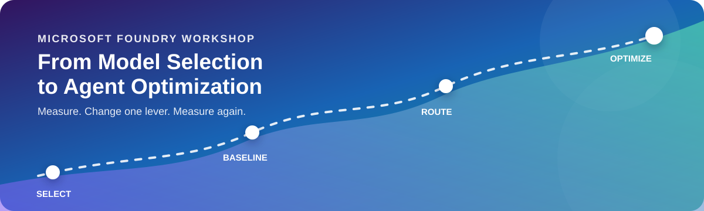

<p align="center">
  
</p>

# Model Mastery Workshop: Select, Build, Optimize

Build, run, and improve a grounded AI agent in 90 minutes with Microsoft Foundry.
You'll pick a model, build **TrailMate** (a product expert for Contoso Outdoors),
measure it, then climb the hill — improving one lever at a time with Model Router
and Agent Optimizer, and promoting the version the evidence supports.

## What you will build

**TrailMate** — a **prompt agent** that answers questions about Contoso Outdoors
gear using the product manuals (via a **file-search** tool), and refuses to
invent anything the manuals don't say.

<table>
<tr>
<td width="38%" valign="top">

</td>
<td width="62%" valign="top">

**You ask:**

> "Heavy rain is coming — Alpine Explorer or TrailMaster X4 tent?"

**TrailMate answers (grounded):**

> "For heavy rain, the **Alpine Explorer Tent** is the better pick — its rainfly
> is rated **3000mm** vs the **TrailMaster X4**'s **2000mm**. Both are 3-season,
> freestanding tents."

It cites the right manual for each product, and if you ask something the manuals
don't cover (like a warranty), it says so instead of guessing. Getting it to do
that **reliably** — and proving it — is the workshop.

</td>
</tr>
</table>

You'll evolve TrailMate through three measured versions, each changing **one
thing**:

| Version | One change | Lesson |
|---------|-----------|--------|
| **v1 · Basecamp** | Frontier GPT + simple instructions + file search | Build a grounded agent; measure a baseline |
| **v2 · Trailfinder** | Model → Model Router | Cut cost/latency without losing quality? |
| **v3 · Summit** | Instructions → optimized (Agent Optimizer) | Improve grounding and honesty |

## Learning objectives

By the end of the core workshop you'll be able to:

- **Right-size a model** for a task by capability, cost, latency, and quality.
- **Build a grounded prompt agent** with a file-search tool over your own documents.
- **Observe agent behavior** with traces and run metrics (AgentOps).
- **Measure a baseline** with a rubric evaluator.
- **"Hill climb"** — improve one lever at a time (Model Router, then Agent
  Optimizer) and promote the version the evidence supports.

## Prerequisites

- A **personal GitHub account** (for Codespaces — a work/enterprise account won't work).
- A modern web browser.
- **Azure access to Microsoft Foundry:**
  - *Instructor-led (Skillable):* provided for you — nothing to install.
  - *Self-guided:* your own subscription with Foundry access.
- The dev container sets up Python 3.13, Azure CLI, `azd`, and every notebook
  package for you.

Models used (Skillable pre-provisions all of them; the self-guided
[`provision.sh`](scripts/provision.sh) deploys the Azure-direct ones and prompts
for Claude):

| Deployment | Role |
|---|---|
| `gpt-5.4` | Frontier reasoning; TrailMate v1 model |
| `gpt-5.4-mini` | Fast/cheap contrast in model selection |
| `model-router` | TrailMate v2 model lever |
| `MAI-Image-2.5-Pro` | Image task in model selection |
| `claude-sonnet-4-6`, `claude-haiku-4-5` | Optional GPT-vs-Claude comparison |

## Choose your track

Setup differs by track; the labs are identical.

- **Instructor-led (Skillable)** → **[instructions/skillable/README.md](instructions/skillable/README.md)** — infra is pre-provisioned; you generate `.env` and go. **Start here for the workshop.**
- **Self-guided (bring your own Azure)** — provisions infra with
  [`scripts/provision.sh`](scripts/provision.sh). Being finalized; follow the
  Skillable steps as reference for now.

## What you'll do

After setup, open the **core** notebooks in order:

| # | Lab | Time | Notebook |
|---|-----|------|----------|
| 00 | Validate setup | 15 min | [labs/core/00-validate-setup.ipynb](labs/core/00-validate-setup.ipynb) |
| 01 | Select the right model | 30 min | [labs/core/01-model-selection.ipynb](labs/core/01-model-selection.ipynb) |
| 02 | Build, evaluate & optimize the agent | 45 min | [labs/core/02-agent-optimization.ipynb](labs/core/02-agent-optimization.ipynb) |

Have time left? The optional **`labs/more/`** notebooks go deeper on specific capabilities — pick any that interest you, in any order:

| # | Lab | Time | Notebook |
|---|-----|------|----------|
| 01 | Multimodal chat | 20 min | [labs/more/01-chat-multimodal.ipynb](labs/more/01-chat-multimodal.ipynb) |
| 02 | Reasoning models | 20 min | [labs/more/02-reasoning-models.ipynb](labs/more/02-reasoning-models.ipynb) |
| 03 | Image generation | 20 min | [labs/more/03-image-generation.ipynb](labs/more/03-image-generation.ipynb) |
| 04 | Model Router | 20 min | [labs/more/04-model-router.ipynb](labs/more/04-model-router.ipynb) |
| 05 | Code with Claude | 20 min | [labs/more/05-code-with-claude.ipynb](labs/more/05-code-with-claude.ipynb) |

## Repository layout

```text
foundry/agent-builder/
├── README.md                      you are here
├── assets/                        banner, product images, attribution
├── instructions/
│   └── skillable/                 Skillable setup (self-guided coming)
├── labs/
│   ├── core/                      the 90-minute workshop — run in order
│   │   ├── 00-validate-setup.ipynb
│   │   ├── 01-model-selection.ipynb
│   │   ├── 02-agent-optimization.ipynb
│   │   └── assets/                screenshots for the core labs
│   └── more/                      optional extra labs
│       ├── 01-chat-multimodal.ipynb
│       ├── 02-reasoning-models.ipynb
│       ├── 03-image-generation.ipynb
│       ├── 04-model-router.ipynb
│       ├── 05-code-with-claude.ipynb
│       └── assets/                screenshots for the more labs
├── scripts/                       provision.sh · setenv.sh · sample.env
└── src/
    ├── data/                      manuals · evaluation-cases.jsonl · evaluators/
    └── agent/                     build_agent.py · switch_to_router.py · instructions · VERSIONS.md
```


## Related resources

- [Microsoft Foundry documentation](https://learn.microsoft.com/azure/ai-foundry/)
- [Foundry models](https://learn.microsoft.com/azure/ai-foundry/concepts/foundry-models-overview)
- [File search tool](https://learn.microsoft.com/azure/ai-foundry/agents/how-to/tools/file-search)
- [Model Router](https://learn.microsoft.com/azure/ai-foundry/openai/concepts/model-router)
- [Agent Optimizer overview](https://learn.microsoft.com/azure/foundry/agents/concepts/agent-optimizer-overview)
- [Optimize a prompt agent (quickstart)](https://learn.microsoft.com/azure/foundry/agents/quickstarts/quickstart-optimize-prompt-agent)
- [Evaluation in Microsoft Foundry](https://learn.microsoft.com/azure/ai-foundry/concepts/evaluation-approach-gen-ai)

Part of [Model Mastery](../../README.md) · [Browse Foundry workshops](../README.md)
