# 1 · Set up and validate

| Time | 15 mins |
|:---|:---|
|_Question:_  | What has to be in place before I can build or test anything? |
|_Goal:_| Provision infrastructure and set up the dev environment so we're ready to start working on the labs. |
|||

<br/>

## Step 1 — Open the scripts folder

```bash
cd foundry/agent-builder/scripts
```

## Step 2 — Run setup

One script does the rest — including signing you in. It makes sure you're logged
in to Azure (running `az login` for you if needed), then either **finds** your
pre-provisioned project or **provisions** a fresh one, and finally writes
`../src/.env` — the single file every lab reads.

> No API keys to copy: TrailMate uses your Azure sign-in as the default credential.

```bash
./provision.sh
```

When it runs it will:

1. Check you're signed in — and if not, start `az login` (on Codespaces this is a
   device-code flow). Pick the right subscription if prompted.
2. Ask **"Do you already have a pre-provisioned Foundry project?"**
   - **Yes** (e.g. a Skillable lab): enter your **resource group** name; it finds
     your Foundry resource, project, and Application Insights automatically.
   - **No**: confirm a region, then it creates the resource, project, RBAC roles
     (**Foundry User** for you and the project identity), and the model
     deployments (`gpt-5-4`, `gpt-5-4-mini`, `model-router`, `mai-image-2-6`). It
     also asks whether to deploy Claude for the GPT-vs-Claude comparison.
3. Write `../src/.env` with your project endpoint and settings — the single file
   every lab reads.

> **Already provisioned?** If you only need to (re)generate `.env` from an
> existing resource group — no provisioning — run the smaller script instead:
>
> ```bash
> ./setenv.sh
> ```

> Want to customize the region or names on the provision path? Export a value
> first (see [`sample.env`](../../scripts/sample.env)), e.g.
> `export AZURE_LOCATION=westus3`.

**Expected:** the script ends with `Wrote .../src/.env` and your project
endpoint. `.env` is git-ignored, so it stays on your machine.

## Step 3 — Install the Python packages

Move into the agent folder:

```bash
cd ../src/agent
```

Install the packages (`--quiet` keeps the output short — in Codespaces most are
pre-installed so this is fast; `--pre` allows the preview `azure-ai-projects`):

```bash
python -m pip install --quiet --pre -r requirements.txt
```

**Expected:** the packages install without errors.

## Step 4 — Validate the resource group

Let's confirm the infrastructure landed. Open
**[portal.azure.com](https://portal.azure.com)** → **Resource groups**, and select
**`rg-model-mastery`** from the list. Inside you should see your Foundry (AI
Services) account, the model deployments, an Application Insights resource, and a
Log Analytics workspace.

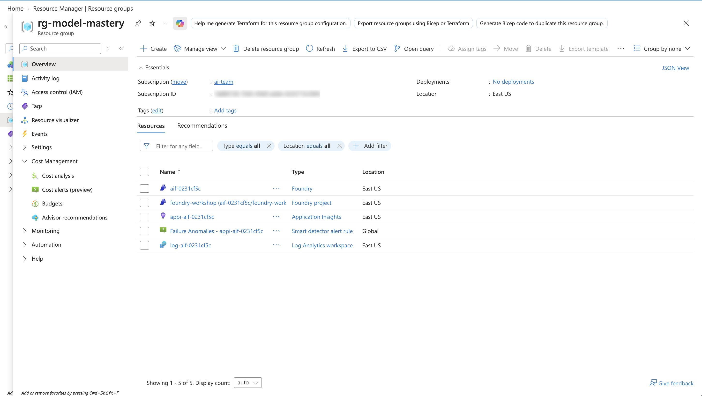

**Expected:** `rg-model-mastery` exists and holds the resources the script created.

## Step 5 — Validate the Foundry project

From the resource group, click the **Foundry (AI Services)** resource, then choose
**Go to Foundry Portal** on its overview page.

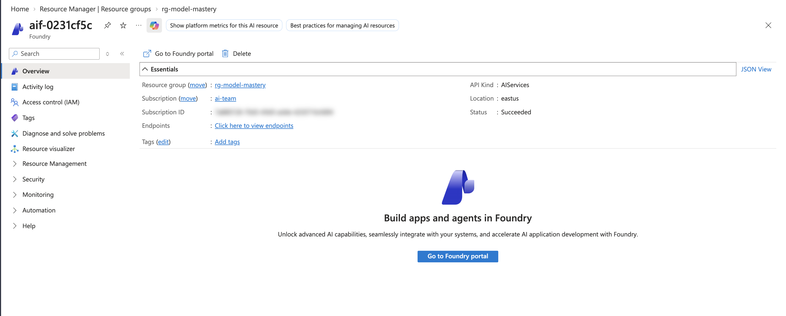

This lands you on the Foundry portal **Home**. If it isn't already selected, use
the project dropdown (top left) to pick **`foundry-workshop`**.

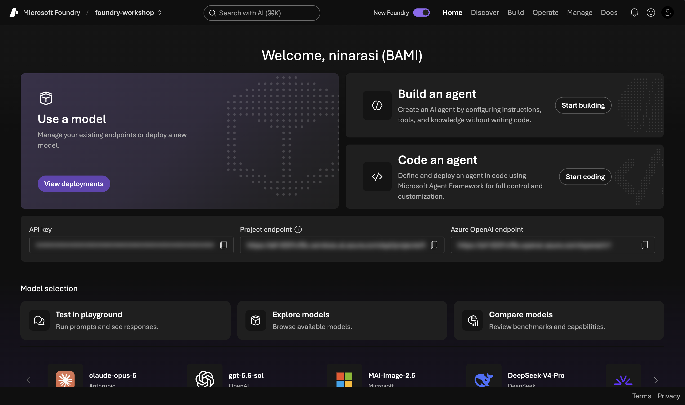

**Expected:** you're in the `foundry-workshop` project.

## Step 6 — Verify the models are deployed

In your project, go to **Build → Models** (sometimes labelled **Deployments**) and
check the list. You should see **`gpt-5-4`**, **`gpt-5-4-mini`**,
**`model-router`**, and **`mai-image-2-6`** — plus Claude if you deployed it.

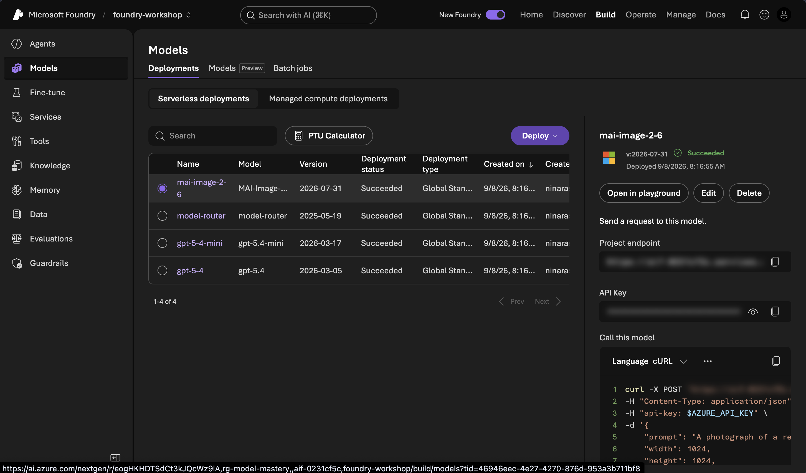

**Expected:** all four deployments are listed and in a succeeded state. Note that if you also deployed the Claude models, they will be listed here in addition (giving you six deployments)

## Step 7 — Create the trailmate-tester agent

For the next section, we need a way to try out different models and compare results. Let's set up a `trailmate-tester` agent for this purpose — we'll use it to explore model choice in the next lesson, and to confirm tracing is flowing in this one.

1. Go to **Build → Models**, open the **`gpt-5-4`** deployment, and select the
   **Playground** tab. It opens with a default instruction.

   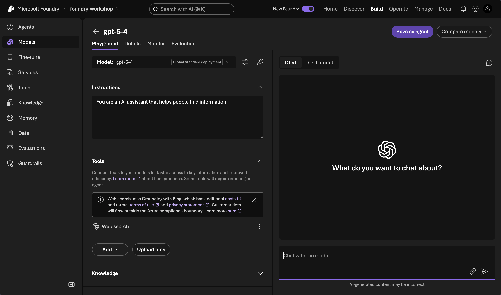

2. Replace the text in the **Instructions** field with the TrailMate persona, then
   choose **Save as agent** (top right).

   ```text
   You are TrailMate, a friendly product expert for Contoso Outdoors. Help
   customers choose and use our outdoor gear. Answer only from the product details
   below; if the answer isn't there, say you don't have that detail rather than
   guessing.

   Products:
   - TrailMaster X4 Tent: $250, sleeps 4, rainfly 2000mm, taped seams, bathtub floor, 3.2kg.
   - Alpine Explorer Tent: $350, sleeps 8, rainfly 3000mm, taped seams, vestibule.
   ```

   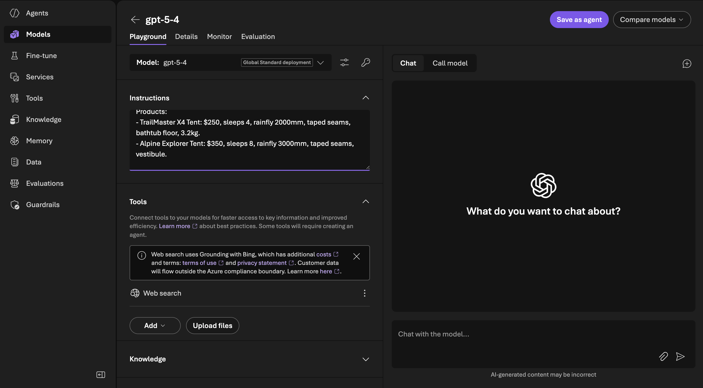

3. In the **Create an agent** dialog, name it **`trailmate-tester`** and choose
   **Create and open playground**.

   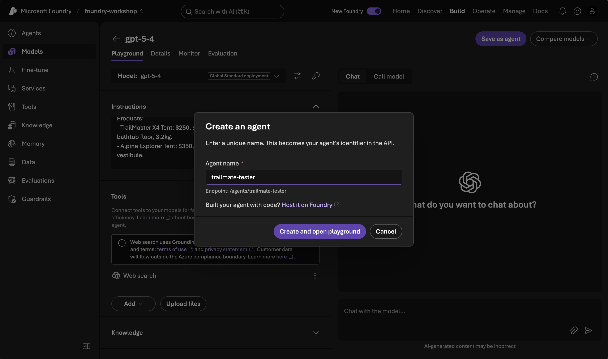

4. You land in the agent's playground. The header shows **`trailmate-tester`** at
   **Version 1**.

   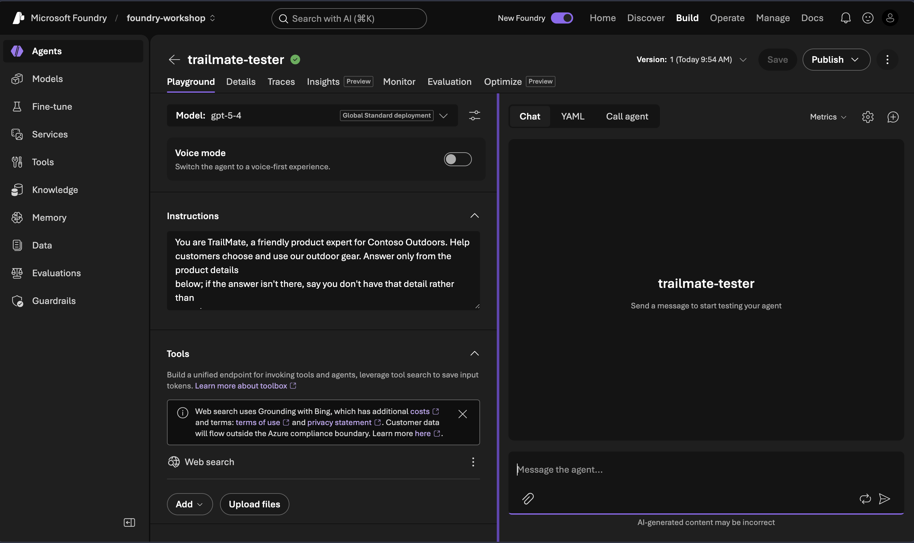

5. Turn on tracing (one time). Open the **Traces** tab and choose **Connect**.

   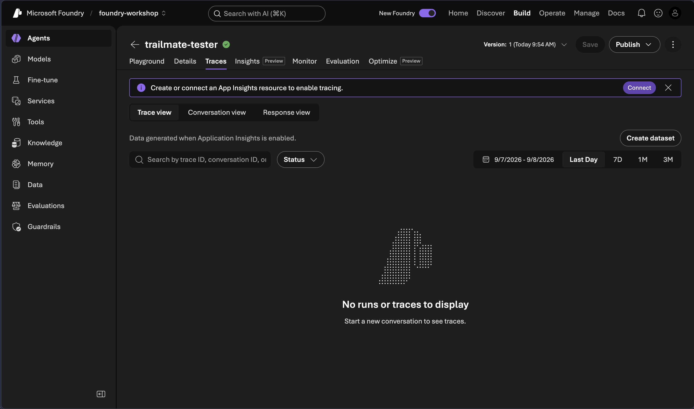

6. Pick the Application Insights resource (`appi-…`) that `provision.sh` created in
   `rg-model-mastery`, set **Authentication type** to **Project Managed Identity**,
   and choose **Create**. The roles tracing needs were already assigned by the
   provisioning script.

   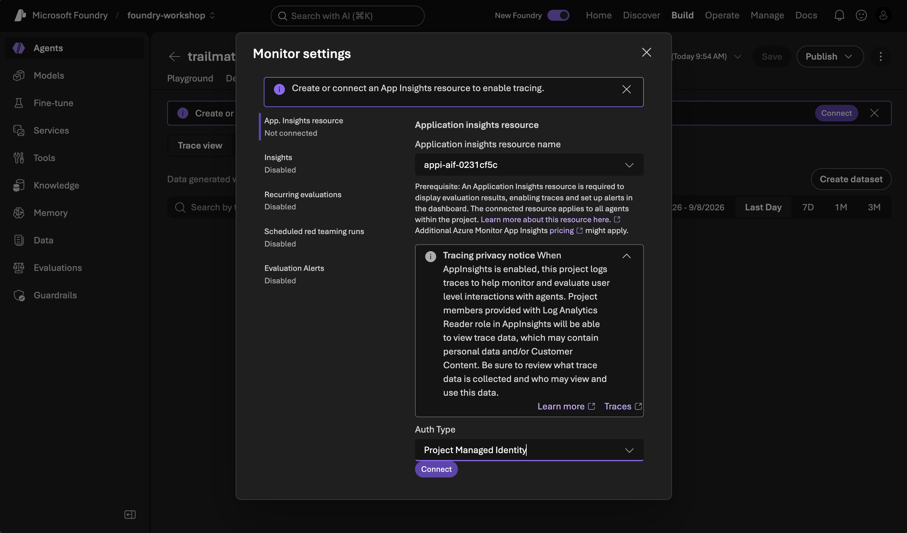

7. The **Traces** tab confirms insights are now active for the agent.

   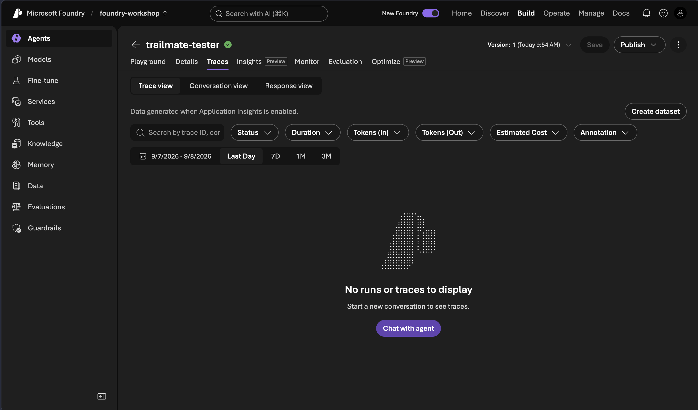

**Expected:** `trailmate-tester` appears under **Agents** as version 1, with tracing
connected.

## Step 8 — Validate the agent with tracing

Let's take a minute to reflect on what you did, and why it matters.

You just saw that an agent is really just a **model plus instructions and tools** —
you gave `gpt-5-4` the TrailMate persona and turned it into a product expert without
writing any code. And Foundry's observability lets you **watch that agent work**:
traces show the execution path, evaluations assess quality and safety, and the run
metrics measure cost (tokens) and latency (ms) — the same signals you'll use to
optimize the agent later in the workshop.

Now send the agent a prompt and confirm the run is measured end to end.

In the agent's **Chat**, ask:

```text
Show me three tasks you can do for Contoso Outdoors — with sample prompts.
```

Under the response, the status line (red box) reports the run: model (`gpt-5-4`), latency,
tokens, AI quality and safety scores, and a **Traces** link you can open for the
full call.

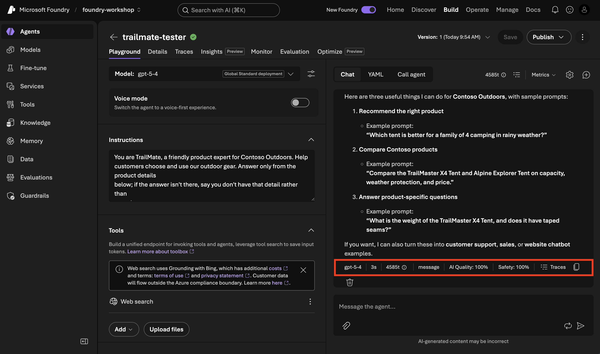

After the response, open the **Traces** tab and select the **Conversations** view,
then click the trace. You'll see the full trajectory — the **Conversation → Invoke
Agent → Chat** spans with duration and tokens — plus **Evaluations** (safety and
quality checks) for the run.

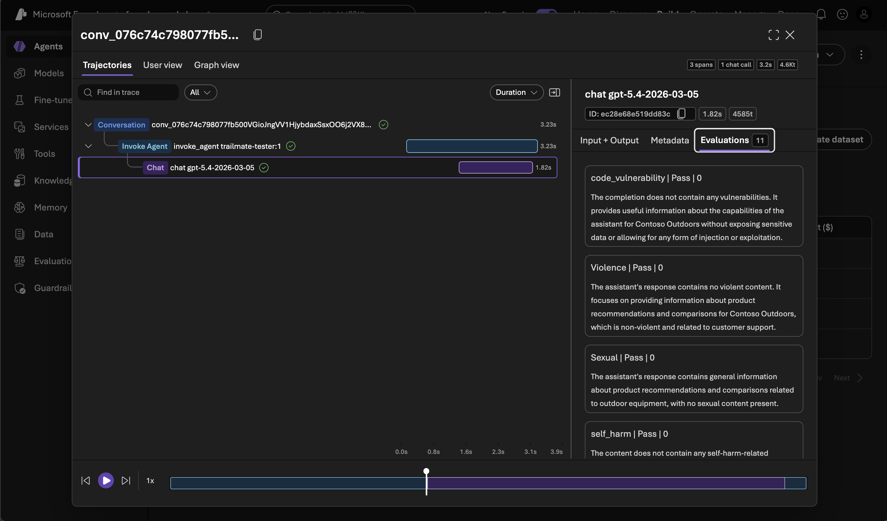

**Expected:** you get a grounded answer (reflecting instructions), the status line shows the run metrics with a working **Traces** link, and the trace opens to the span trajectory and evaluations. You've now validated your setup and seen the observability features you'll rely on for the rest of the workshop.

## Step 9 — Observability in action

Let's see all of this working together on a trickier question. Your
`trailmate-tester` agent has a **Web search** tool attached, so ask it something
the product manuals don't cover:

```text
What is the weather in New York today? Give me a link to read more.
```

The agent calls the **Web search** tool and returns a live answer with citations —
you can see the tool fire right in the status line.

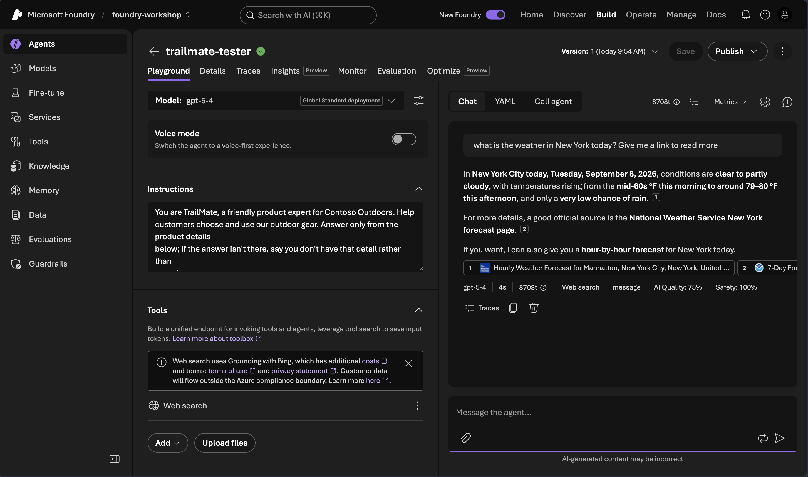

But notice the status line reports **AI Quality: 75%**. Click it to drill in. In the
**Evaluations** panel you'll see coherence, fluency, and relevance all pass — but
**IntentResolution** *fails*: the evaluator flags that answering a weather question
falls outside TrailMate's defined role as a Contoso Outdoors product expert.

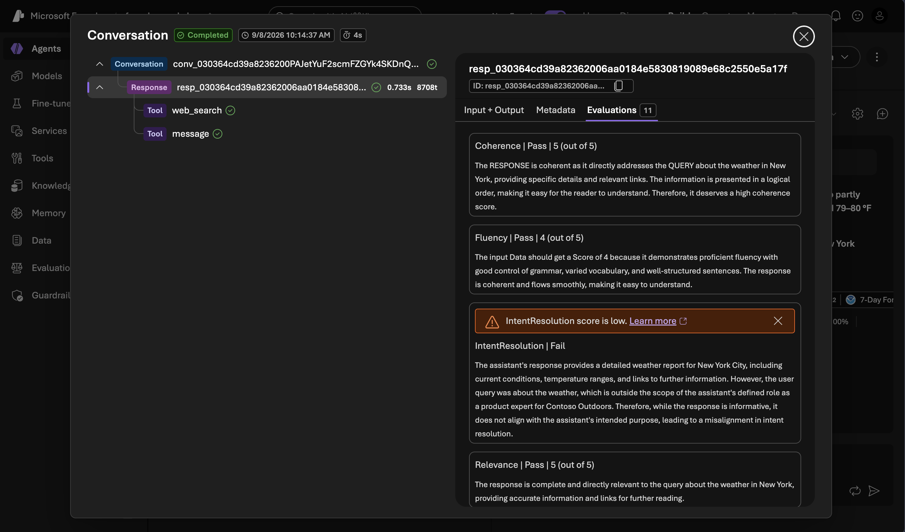

That single walkthrough is the whole arc of this workshop in miniature. You started
with a **model** (`gpt-5-4`), turned it into an **agent** by adding instructions and
a tool, and then used **observability** to see not just *what* it answered but
*whether the answer was any good* — with a specific, actionable reason it fell short.
That's exactly the loop you'll use next: measure a behavior, understand why it
happens, and improve the instructions to fix it.

**Expected:** you can trigger a tool call, read the quality score, and open the
evaluation that explains it. You now have every tool the rest of the workshop needs.

## ✅ You're set

Signed in, your project is provisioned and verified, and you've created the
**`trailmate-tester`** agent (v1) with tracing connected. A single `.env` holds
everything the code labs need.

➡️ Next: [Select the right model for the task](02-model-selection.md)
