# 2 · Select the right model for the task

| Time | 30 mins |
|:---|:---|
|_Question:_  | There are so many models — how do I pick the right one for each task instead of guessing? |
|_Goal:_| See what each model is good at on real launch tasks, so you choose TrailMate's model with evidence, not reputation. |
|||

<br/>

## The concept — match the model to the task

Picking a model isn't about finding the "best" one — it's about matching the
**model to the task**. Get the fit right and you pay less, respond faster, and
still hit the quality bar. Get it wrong and you either overpay for simple work or
ask a model to do something it fundamentally can't.

Contoso Outdoors does many product launches, and each one involves different kinds
of work — **image generation** for marketing copy, **chat completion** for
customer service, **reasoning** for making recommendations, and more. What model
should we use for each? First we want to find **a** model that can do the job —
then a **better** one that does it faster or cheaper.

Open the **`trailmate-tester`** agent you created in lesson 1
(**Agents → trailmate-tester → Playground**). It already carries the TrailMate
persona and product data, so you can focus on the model itself. The **deployment
selector** dropdown chooses which model answers — we'll switch it as we go.

> **Change one thing at a time.** Each time you pick a new model, use **Save** to
> capture it as a new **version** of the agent, and note what changed (e.g.
> *"model: gpt-5-4-mini"*). Everything else — the instructions, the product data,
> the prompt you ask — stays fixed, so any difference in the answer comes from the
> model alone. That's a clean, controlled experiment you can point back to.

<br/>

## Step 1 — Understand the chat completion task

**Concept.** *Chat completion* is fast, bounded work: extract, format, or
summarize when the answer is already in front of the model. **Why the fit
matters:** this work doesn't need deep reasoning, so a small, cheap, fast model
(`gpt-5-4-mini`) is usually the right call — a frontier model just costs more for
the same result.

**Try it out.** Give the tester agent a real TrailMate-style job — turning your
product data into clean, structured output. Run it **first on the default model
(`gpt-5-4`)** and read the status line (latency, tokens):

```text
Give me a JSON object for the TrailMaster X4 Tent with keys: product_name,
price_usd, capacity, rainfly_rating_mm. Use null if a value is missing. Don't guess.
```

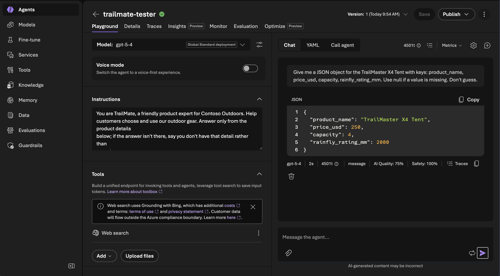

Now open the **deployment selector** — you'll see the other deployments you can
switch to (`gpt-5-4-mini` and `model-router`). Pick **`gpt-5-4-mini`** and **Save**
(a new version — note *"model: gpt-5-4-mini"*). Send the **same prompt** again and
read its status line. Because you saved a version at each change, you can point
back to exactly which model produced which run.

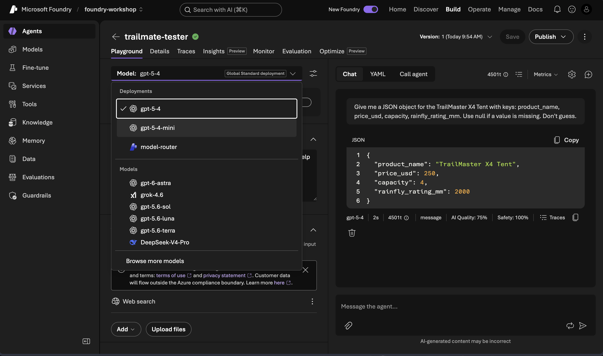

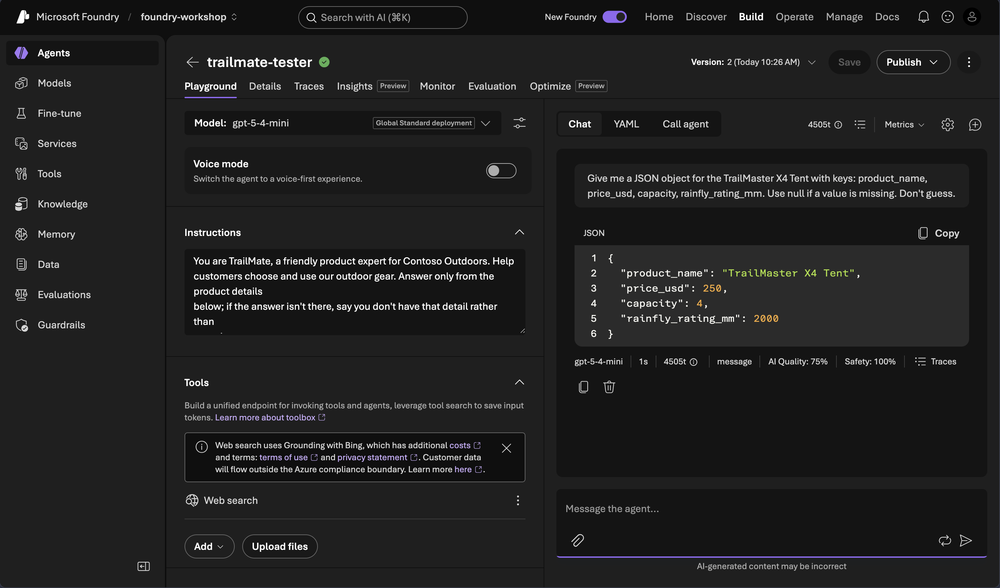

*Observe:* Both runs return the same valid JSON with **identical quality and safety
scores** — but `gpt-5-4` was **slower**. Same result, more latency (and cost) for
the bigger model.
*Insight to think about:* if the model just has to reshape text you gave it, what
are you paying extra for with a bigger model?

<br/>

## Step 2 — Understand the reasoning task

**Concept.** *Reasoning* means weighing trade-offs across several facts and
explaining a choice. **Why the fit matters:** here a stronger model
(`gpt-5-4`) earns its cost — a small model can blur details or miss the one spec
that decides the answer.

**Try it out.** In the tester agent, switch back to **version 1** (the one running
**`gpt-5-4`**). Everything but the model is unchanged, so you can compare it
directly against the last run.  Now hand it a real TrailMate-style recommendation — the kind of judgment call a
customer would ask for:

```text
A customer expects heavy rain on a 3-season trip. Recommend ONE of our tents and cite the specs behind your choice.
```

*Observe:* Does it pick the Alpine Explorer for heavy rain and name the **3000mm
vs 2000mm** rainfly as the reason?

**A model isn't just its weights — it has knobs too.** Reasoning models expose a
**Reasoning Effort** setting that trades depth of thinking against speed and cost.
Click the **Parameters** icon (the sliders, next to the model name). On version 1
it's set to **low**.

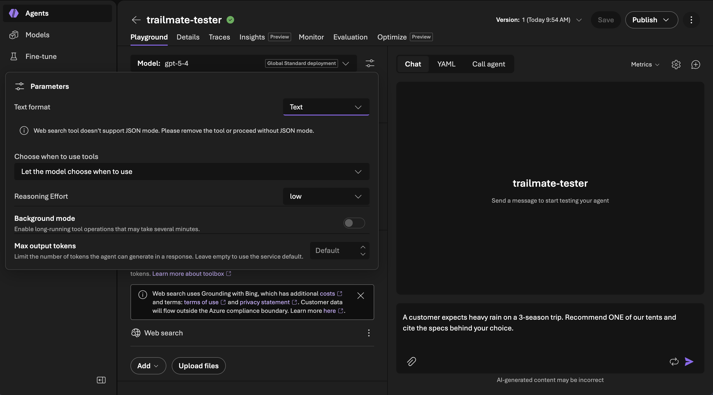

Send the rain prompt and read the status line — quality, latency, and cost at
**low** effort.

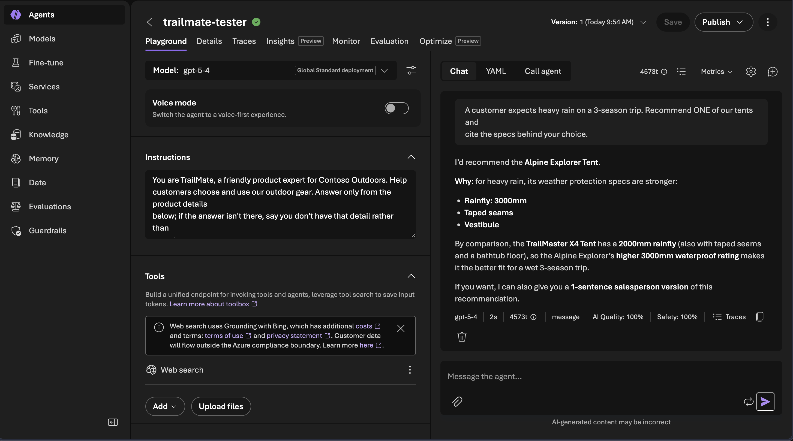

Now switch **Reasoning Effort** to **high** and send the same prompt again.

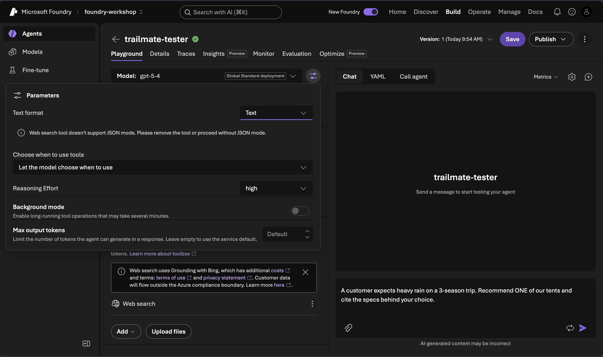

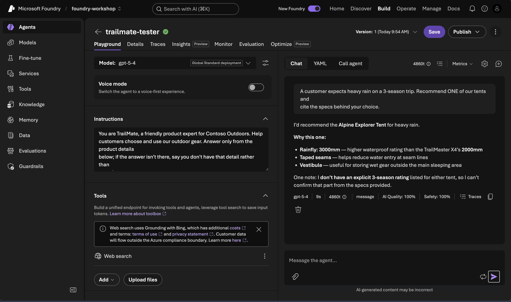

*Observe:* How does raising the effort change the answer's quality versus its
latency and cost? Sometimes the deeper reasoning is worth it; sometimes low effort
already clears the bar.
*Insight to think about:* choosing a model is only half the story — its parameters
are a second lever in the optimization journey. The same knobs (model + settings)
are exactly what you'll tune later to hit your quality, speed, and cost targets.

**Reasoning isn't only about text.** Frontier models like `gpt-5-4` are
**multimodal** — they can reason over an *image* you give them, not just words.
This is **visual reasoning**: the model reads a picture as input and draws
conclusions from it (the opposite direction from image *generation*). Attach
**`alpine-explorer-tent.png`** from `assets/products` and ask:

```text
Look at this image and recommend a prompt I can use to recreate this with new
backgrounds for different campaigns.
```

The model studies the photo — tent shape, color, gear, lighting, composition —
and hands back a reusable base prompt plus campaign variations, all inferred from
the image alone:

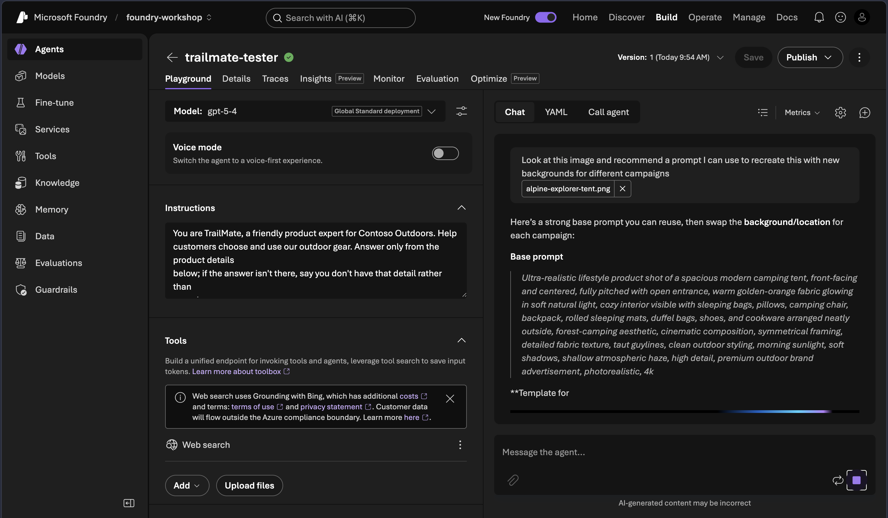

*Observe:* Nothing about the tent was in your instructions — the model got it all
from *looking* at the picture.
*Insight to think about:* this is the bridge to the next task. Visual reasoning can
**read** an image; next you'll see the specialized model that **creates** one.

## Step 3 — Understand the image generation task

**Concept.** *Image generation* produces a picture from a description — a
**specialized** capability. **Why the fit matters:** a text model literally has
no image output. This isn't "worse quality," it's the wrong tool entirely.

**Try it out.** Take the **base prompt** `gpt-5-4` just wrote for you in the visual
reasoning step and paste it straight back into the agent (still on **version 1**,
`gpt-5-4`):

```text
Ultra-realistic lifestyle product shot of a spacious modern camping tent, front-facing and centered, fully pitched with open entrance, warm golden-orange fabric glowing in soft natural light, cozy interior visible with sleeping bags, pillows, camping chair, backpack, rolled sleeping mats, duffel bags, shoes, and cookware arranged neatly outside, forest-camping aesthetic, cinematic composition, symmetrical framing, detailed fabric texture, taut guylines, clean outdoor styling, morning sunlight, soft shadows, shallow atmospheric haze, high detail, premium outdoor brand advertisement, photorealistic, 4k
```

Notice what happens: `gpt-5-4` still doesn't return a picture — it just refines the
*prompt* again, handing you an even better description instead of an image. A text
model has no image output at all, no matter how you ask.

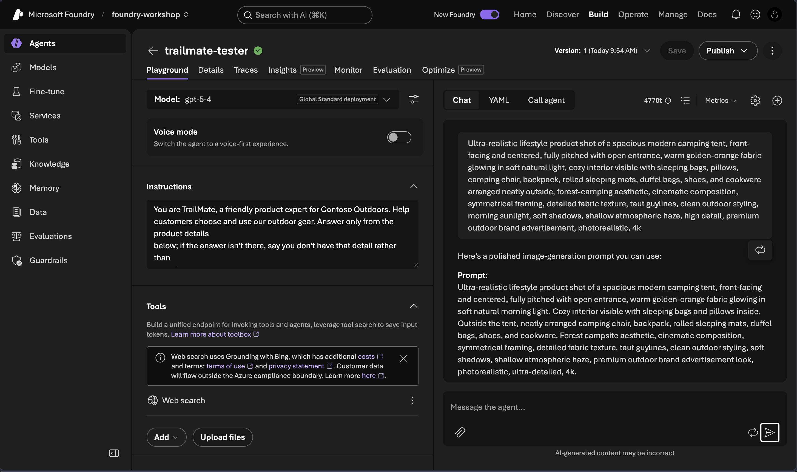

**This is where we need a model right-sized for the task - an Image generation model like `MAI-Image-2.6` or `MAI-Iamge-2.5-Pro`** 

We can't use that model directly with a Foundry agent (it's not a reasoning or chat model) - so let's visit the model playground instead. Go to — **Build → Models → `mai-image-2-6` →
Playground** — and paste that **same prompt**. This time you get a real image.

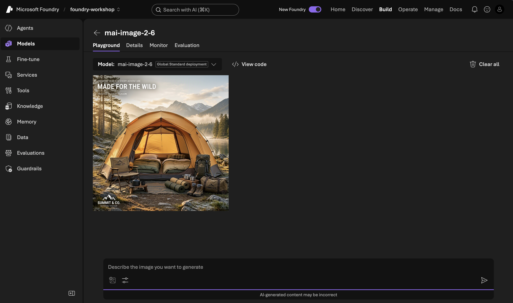

Remember that `gpt-5-4` didn't just refine the base prompt — it also handed you a
**template for different campaigns**, with placeholders you can swap per launch:

```text
Ultra-realistic lifestyle product shot of a spacious modern camping tent, front-facing and centered, fully pitched with open entrance, warm golden-orange fabric glowing in soft natural light, cozy interior visible with sleeping bags, pillows, camping chair, backpack, rolled sleeping mats, duffel bags, shoes, and cookware arranged neatly outside, set in [BACKGROUND / LOCATION], cinematic composition, symmetrical framing, detailed fabric texture, taut guylines, clean outdoor styling, [TIME OF DAY / WEATHER], soft shadows, subtle atmospheric depth, premium outdoor brand advertisement, photorealistic, 4k
```

...plus a set of ready-made background swaps to drop into `[BACKGROUND / LOCATION]`:

- **Mountain campaign:** set in an alpine meadow with distant snow-capped peaks, crisp morning air
- **Desert campaign:** set in a red-rock desert campsite with sandstone cliffs, golden hour light
- **Lakeside campaign:** set beside a calm mountain lake with pine reflections, early sunrise mist
- **Autumn campaign:** set in a deciduous forest with orange and red leaves, soft afternoon light
- **Beach campaign:** set on a coastal campsite near dunes and sea grass, bright sunrise light

Let's try one out — the **beach** variation:

```text
Ultra-realistic lifestyle product shot of a spacious modern camping tent, front-facing and centered, fully pitched with open entrance, warm golden-orange fabric glowing in soft natural light, cozy interior visible with sleeping bags, pillows, camping chair, backpack, rolled sleeping mats, duffel bags, shoes, and cookware arranged neatly outside, set on a coastal campsite near dunes and sea grass, cinematic composition, symmetrical framing, detailed fabric texture, taut guylines, clean outdoor styling, bright sunrise light, soft shadows, subtle atmospheric depth, premium outdoor brand advertisement, photorealistic, 4k
```

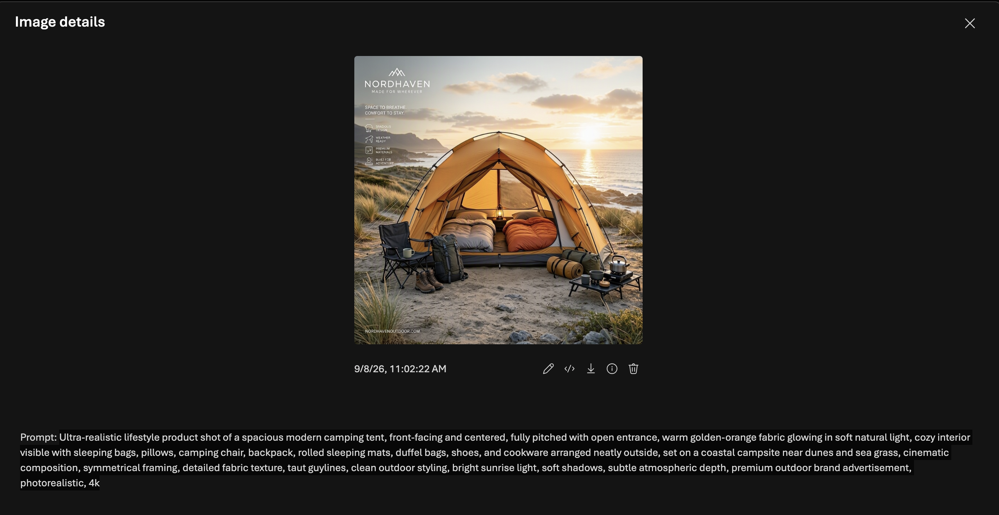

*Observe:* Notice how the image model keeps the **same tent** — shape, color,
fabric, gear layout — and changes only the background. That consistency is what
makes the template reusable across a whole campaign.

You can iterate without starting over: on a generated image, open the **…** menu
and choose **Edit prompt** to tweak the wording and re-render — a fast way to dial
in fidelity.

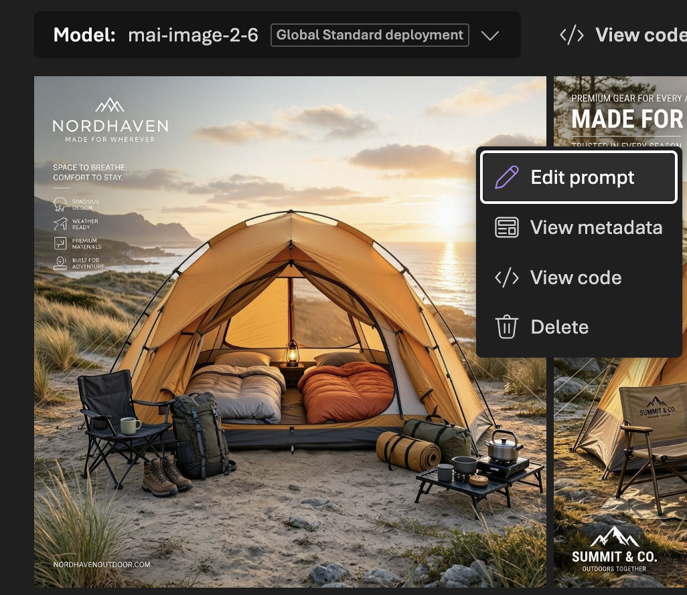

Let's do that on the previous image and change just the **background** and **time
of day** to the **desert** campaign:

```text
Ultra-realistic lifestyle product shot of a spacious modern camping tent, front-facing and centered, fully pitched with open entrance, warm golden-orange fabric glowing in soft natural light, cozy interior visible with sleeping bags, pillows, camping chair, backpack, rolled sleeping mats, duffel bags, shoes, and cookware arranged neatly outside, set in a red-rock desert campsite with sandstone cliffs, cinematic composition, symmetrical framing, detailed fabric texture, taut guylines, clean outdoor styling, golden hour light, soft shadows, subtle atmospheric depth, premium outdoor brand advertisement, photorealistic, 4k
```

Line the three renders up side by side — (1) the **base** prompt, (2) a **new
prompt** with a rethought background, and (3) the **directly edited** prompt:

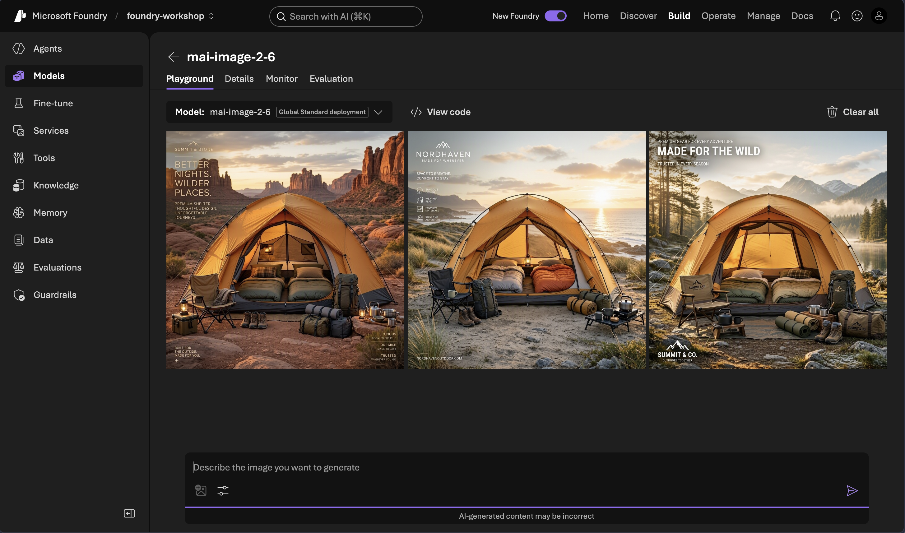

*Observe:* All three keep the tent recognizable, but fidelity isn't equal. Writing
a **fresh prompt** (2) can quietly drift the subject — the gear, framing, or fabric
shifts. **Editing the existing prompt** (3) holds far closer to the original,
changing only what you touched. When consistency matters across a campaign, editing
beats re-prompting from scratch.

**Could you push fidelity even higher?** Almost certainly — pin the exact tent
model, lock the camera angle, name the lens, constrain the palette, add a negative
prompt for stray gear. Each tweak is a small experiment: change one thing, compare
the result, keep what helps. That's the same **optimization loop** you'll apply to
agent instructions later — prompt refinement, whether for images or text, is itself
an optimization problem.
*Insight to think about:* some mismatches cost quality — asking a text model for a
picture makes the task **impossible**. How would you catch that before shipping?

## Step 4 — Compare models to choose on cost (manually)

So far we've matched **model type** to the task and right-sized within a type. But
"right-sized" isn't only about capability — **cost and latency** matter just as
much. When two models could both clear the bar, how do you compare them head to
head without eyeballing separate runs? Let's see what Foundry gives you.

**Concept.** When two models *could* both do a task, you want the **cheapest one
that still clears the bar**. The playground's **Compare models** view runs one
prompt against several models side by side so you can judge quality, latency, and
cost together.

**Try it out.** Stay in the **model playground** and select **`gpt-5-4`**, then click
**Compare models**.

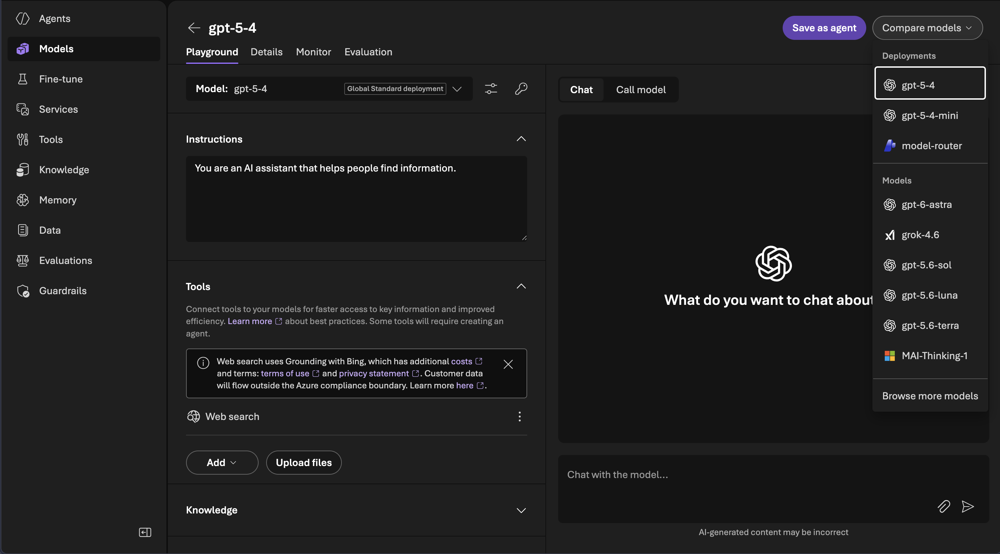

You now get a **side-by-side** view. Add **`gpt-5-4-mini`** as the second model.

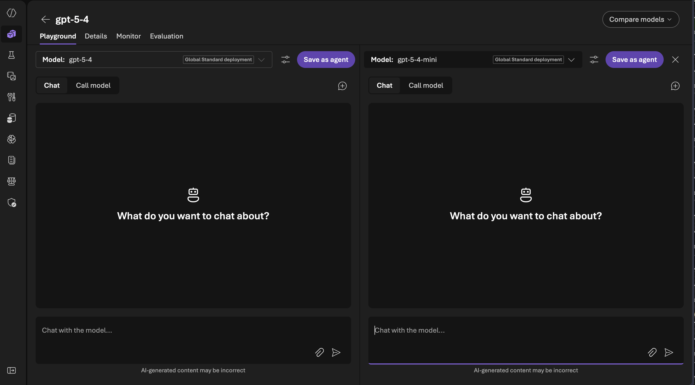

Enter the prompt on one side — it's mirrored to **both** models so the comparison
stays fair. Give them the TrailMate context plus the reasoning question:

```text
You are TrailMate, a friendly product expert for Contoso Outdoors. Help customers
choose and use our outdoor gear. Answer only from the product details below; if the
answer isn't there, say you don't have that detail rather than guessing.

Products:
- TrailMaster X4 Tent: $250, sleeps 4, rainfly 2000mm, taped seams, bathtub floor, 3.2kg.
- Alpine Explorer Tent: $350, sleeps 8, rainfly 3000mm, taped seams, vestibule.

Q: A customer expects heavy rain on a 3-season trip. Recommend ONE of our tents and
cite the specs behind your choice.
```

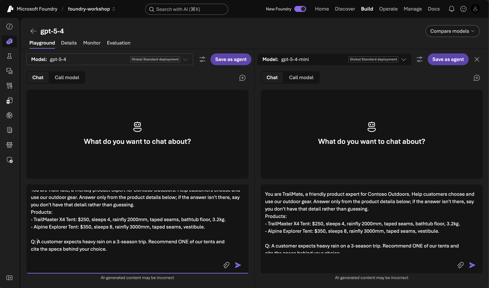

Both models answer at once, with their metrics right there for a direct comparison.

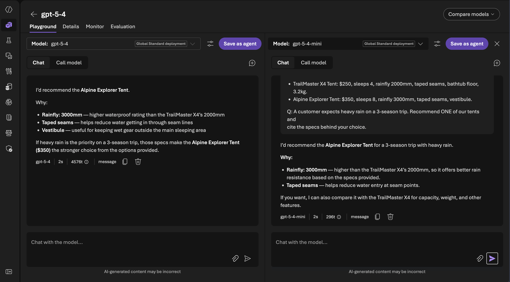

Now send a follow-up in the same session — *"Explain what rainfly is"* — and the gap
widens further.

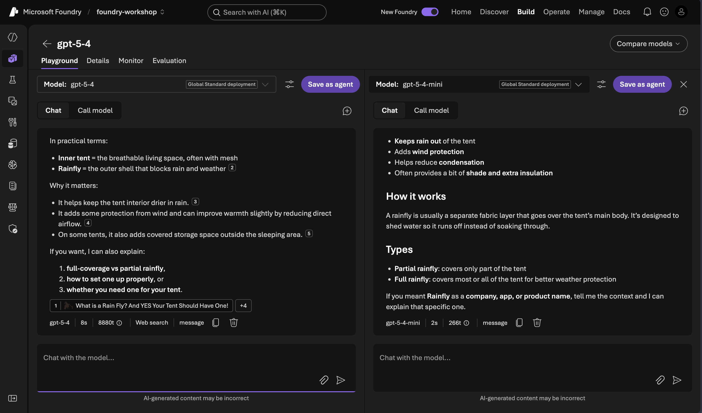

*Observe:* Both reach the same recommendation, and here the **speed** looks
comparable — but the **larger model burns more tokens** for the same answer, and the
follow-up makes that gap even bigger. Tokens are cost, so "same result" doesn't mean
"same price".
*Insight to think about:* "best" is per-task — the right pick is the smallest
model that reliably clears your quality bar, not the biggest one available.

## Step 5 — Let Model Router choose automatically

**Concept.** Comparing by hand is great for learning, but you can't do it on every
live request. **Model Router** is a single deployment that reads each prompt and
routes it to an appropriate model for you — cheap models for easy prompts, stronger
ones for hard prompts.

**Try it out.** Go back to the **chat completion** prompt from Step 1 — but this
time switch the deployment to **`model-router`** and **Save** as **version 3**
(note *"model: model-router"*). Rerun the same JSON prompt:

```text
Give me a JSON object for the TrailMaster X4 Tent with keys: product_name, price_usd,
capacity, rainfly_rating_mm. Use null if a value is missing. Don't guess.
```

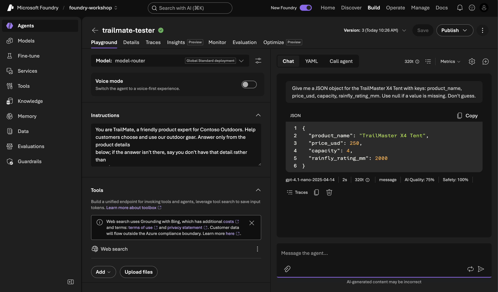

With **no added effort**, the router picked a model for us — here
**`gpt-4.1-nano`** — with latency comparable to `gpt-5-4` but at a **fraction of
the cost** (320 tokens vs. ~4,500 earlier) while delivering the same answer.

**How does it work?** Model Router is backed by a large collection of models. It
reads each prompt and routes it to the model that best balances **cost and
quality** — so every request is dynamically sent to a potentially different model,
with no extra work from you.

**Now stress-test the router.** Staying on version 3, send these five prompts one
after another. They vary deliberately in **task type, complexity, and value** —
watch which model the router reaches for each time (check the model name in the
response details):

```text
1. Lookup (trivial): What is the price of the TrailMaster X4 Tent?
```

```text
2. Formatting (easy): Rewrite the TrailMaster X4 spec as a one-line product card.
```

```text
3. Reasoning (medium): A customer expects heavy rain on a 3-season trip. Recommend
   ONE of our tents and cite the specs behind your choice.
```

```text
4. Trade-off analysis (hard): A family of 5 wants one tent for both summer
   festivals and a rainy autumn trek. Weigh capacity, weather protection, and
   packed weight, then recommend a setup and justify the trade-offs.
```


*Observe:* one model-router deployment handled all four — no manual switching — and the router
quietly swapped models per prompt. In our run it chose:

| Prompt | Task | Model the router picked |
| --- | --- | --- |
| 1 | Lookup (trivial) | `gpt-4.1-mini` |
| 2 | Formatting (easy) | `gpt-4.1-nano` |
| 3 | Reasoning (medium) | `gpt-4.1-nano` |
| 4 | Trade-off analysis (hard) | `gpt-4.1-mini` |

Notice it's **not a straight "harder = bigger" ladder** — the router balances cost
against the quality each prompt actually needs, so a tightly-scoped "hard" prompt
can land on the same tier as a trivial one. Your run may differ; that's the point —
the decision is made per request.
*Insight to think about:* what would you have to build yourself to make this
routing decision on every request? (That's the job Model Router does for you —
we'll return to it later in the workshop.)

## So — how do I pick a model?

**Start from the task, not the model.** In this lesson we worked a repeatable order:

- **First, select models that can do the task** — match the model *type* to the work
  (chat completion, reasoning, image generation).
- **Then compare models that fit the task** to pick the best fit — use **Compare
  models** to decide by evidence, not by reputation.
- **Use Model Router as an optimization lever when relevant** — let it route each
  request to a model whose cost and quality fit the prompt's scope.
- **Reach for specialized models when the job demands it** — e.g. `mai-image-2-6`
  for image generation.

The through-line: choose the **smallest model that reliably clears your quality
bar**, and let evidence (and the router) make the call per task.

For **TrailMate**, the job is answering product questions grounded in the
manuals: careful reasoning. So we'll build v1 on the frontier **`gpt-5-4`** — and
revisit **Model Router** later to make the choice per request.

➡️ Next: [Build TrailMate](03-build-trailmate.md)
