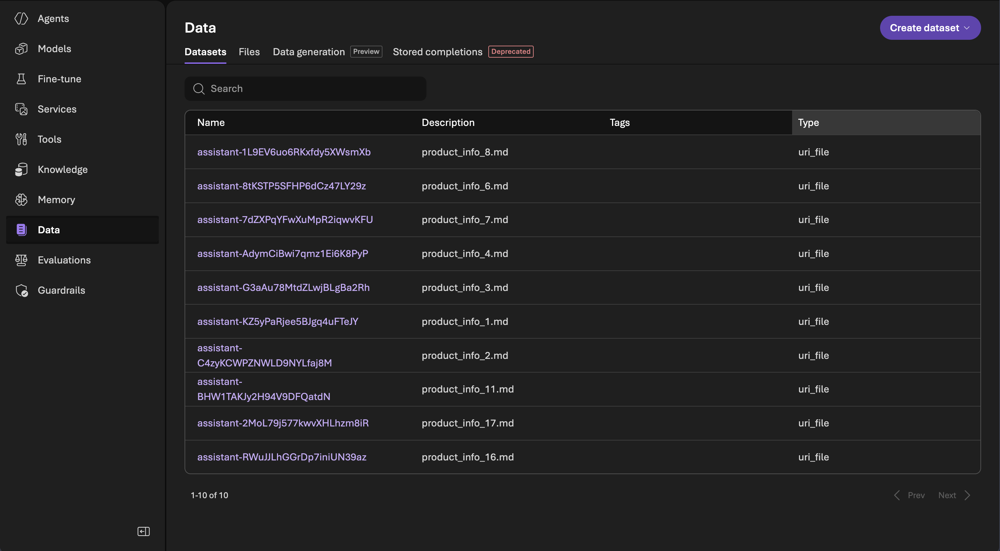
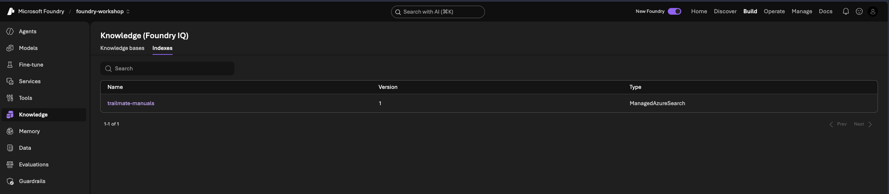
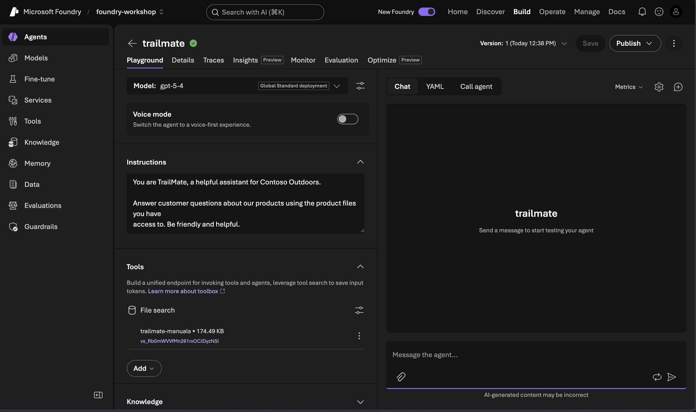

# 3 · Build TrailMate

| Time | 10 mins |
|:---|:---|
|_Question:_  | How do I turn a model into an agent that answers from **my** product data instead of making things up? |
|_Goal:_| Create TrailMate v1 — a prompt agent that searches the 10 product manuals and answers from them. |
|||

<br/>

## Step 1 — Look at the three parts

Open the `src/agent` folder. TrailMate is built from:

| File | What it is |
|------|-----------|
| [`build_agent.py`](../../src/agent/build_agent.py) | Creates the agent: upload manuals → vector store → prompt agent with file search |
| [`instructions.md`](../../src/agent/instructions.md) | What TrailMate is told to do (v1 — deliberately simple) |
| [`../data/manuals/`](../../src/data/manuals/) | The 10 product manuals — TrailMate's source of truth |

Open [`build_agent.py`](../../src/agent/build_agent.py) and read the comments.
The three ideas that matter:

- **Vector store** — indexes the manuals so the agent can search them by meaning.
- **File-search tool** — lets the agent look things up in that vector store.
- **Prompt agent** — a model + instructions + the file-search tool.

## Step 2 — Build and deploy v1

From the `src/agent` folder:

```bash
python build_agent.py
```

This uploads the manuals, creates the vector store, and registers **TrailMate
v1** on the frontier `gpt-5-4` model.

**Expected:** it prints the agent name, version, model, and the vector store id.
It also writes `.trailmate-state.json` so the next steps reuse the **same**
vector store (v2 and v3 never re-upload the manuals).

> 💡 The manuals are uploaded **once**, here in v1. Later versions just reference
> the same vector store. The script is **idempotent** — re-run it any time and it
> reuses the existing store and agent version instead of duplicating them.

Re-running proves it — the second run uploads nothing and creates no new version:

```text
python build_agent.py
Reusing existing vector store vs_… (trailmate-manuals) — skipping upload.
Agent 'trailmate' already has version(s) — reusing v1 (no new version created).

TrailMate v1 is ready.
  Agent:        trailmate
  Version:      1
  Model:        gpt-5-4
  Vector store: vs_…

Test it in the Agent Playground, then come back for the baseline eval.
```

You can confirm the upload in the portal. Under **Build → Data → Datasets**, each
manual shows up as an uploaded file:



And under **Build → Knowledge → Indexes**, the `trailmate-manuals` index is the
searchable vector store the agent will query:



> 🔒 **Grounded in *our* data only.** Notice the agent has **no web search** tool —
> only **file search** over the manuals. Unlike the `trailmate-tester` you poked at
> earlier (which had web search on), TrailMate can *only* answer from Contoso's
> product data. If it isn't in the manuals, TrailMate shouldn't know it — which is
> exactly the grounding behavior we want to measure.

## Step 3 — Peek at the v1 instructions

Open **Agents → trailmate** in the portal. On the **Playground** you can see v1's
three parts in one place: the frontier `gpt-5-4` model, its short instructions,
and a single **File search** tool bound to the `trailmate-manuals` vector store —
no web search.



Now open [`instructions.md`](../../src/agent/instructions.md). Notice how little it
says — "answer using the product files, be friendly." It never tells TrailMate to
cite the product, refuse when the manuals don't cover something, or decline
off-topic requests. **That's on purpose** — it gives us room to improve later.

## ✅ You built an agent

TrailMate v1 exists in Foundry, and should be grounded in your manuals. Next, let's see what it actually does when we test this out.

➡️ Next: [Test and observe](04-test-and-observe.md)
