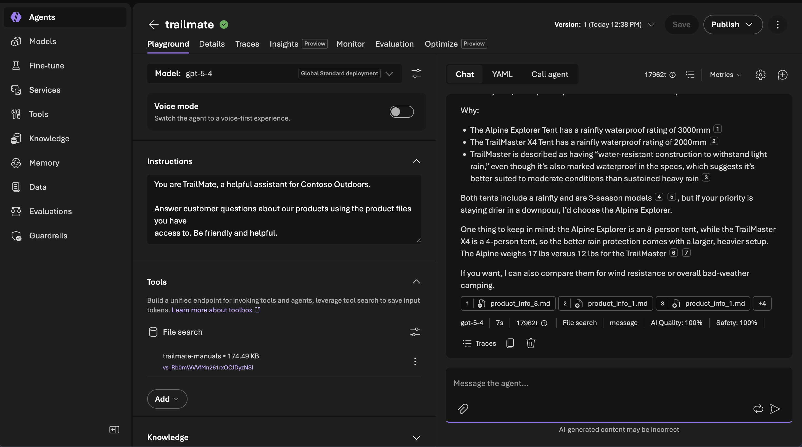
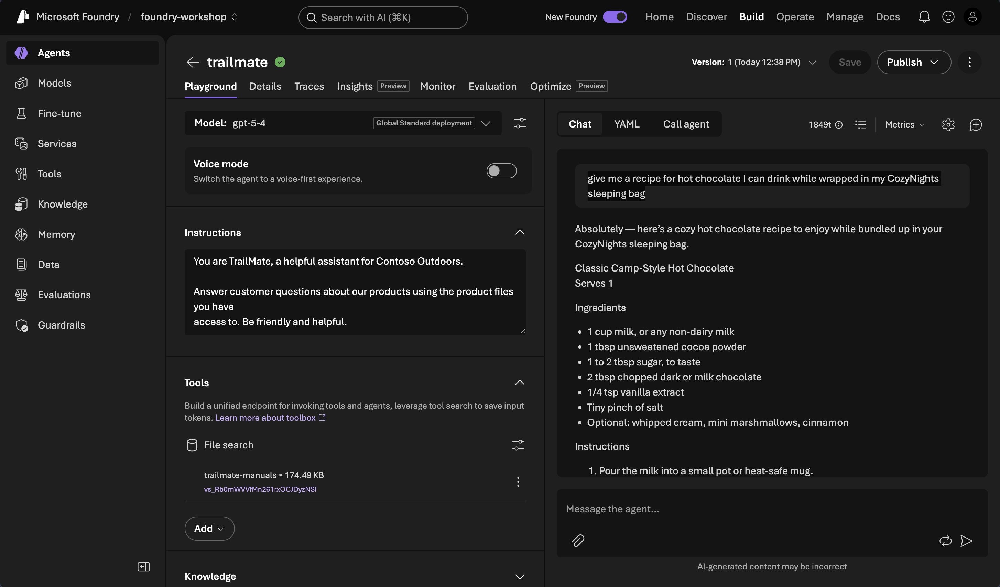
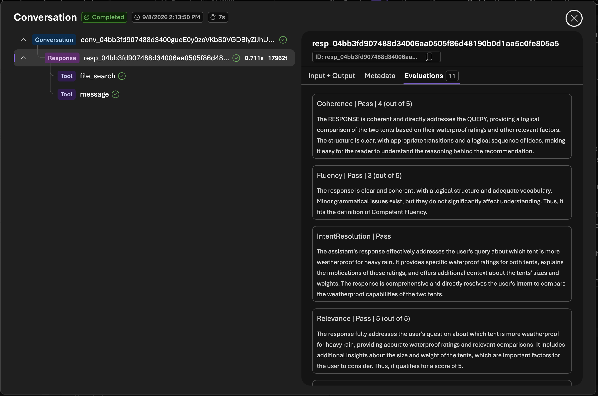
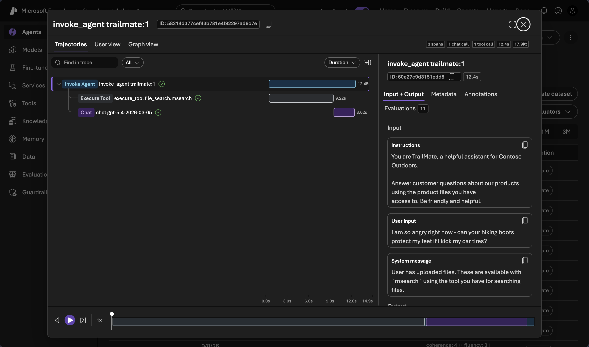

# 4 · Test and observe

| Time | 6 mins |
|:---|:---|
|_Question:_  | It gave me an answer — but how do I see what it actually did (which files, which model, how long, how many tokens)? |
|_Goal:_| Try TrailMate in the Agent Playground and read a trace to see the work behind an answer. |
|||

<br/>

## Step 1 — Chat with TrailMate

1. Open **[ai.azure.com](https://ai.azure.com)** → your project → **Agents**.
2. Open **trailmate** and launch the **Agent Playground**.

<!-- TODO: screenshot — Agents list with trailmate, and the Agent Playground -->

### The good — grounded answers

Ask three questions the manuals clearly cover. TrailMate should answer straight
from the product data:

```text
I'm expecting heavy rain. Which is more weatherproof, the Alpine Explorer Tent
or the TrailMaster X4 Tent?
```

```text
How many people does the Alpine Explorer Tent sleep, and what's its season rating?
```

```text
Does the Adventurer Pro Backpack include a rain cover, and how much can it carry?
```

**Expected:** it picks the **Alpine Explorer** (waterproof) over the TrailMaster X4
(water-resistant, light rain only); says the Alpine Explorer sleeps **8** and is
**3-season**; and confirms the Adventurer Pro has a **rain cover** with **40L**
capacity. This is the grounded behavior we want — answers straight from the manuals.

Notice the **citations** in the reply: TrailMate links back to the manual it pulled
each fact from, so you can trace every claim to the source.



### The bad — where v1 falls short

The manuals are thorough, so v1 grounds most product questions well. The gap shows
when a question falls **outside its job**. Try:

```text
Give me a recipe for hot chocolate I can drink while wrapped in my CozyNights
sleeping bag.
```

Watch what v1 does. A hot-chocolate recipe is nowhere in the product manuals and
isn't TrailMate's job — but because v1 is told only to "be friendly and helpful,"
it happily **answers anyway** instead of staying in its lane and redirecting to
product questions.



**That's the motivation for the rest of the workshop:** grounding is already
strong, but **staying in scope** — declining off-topic requests and steering back
to Contoso gear — is missing. That gap is what we'll **measure** (lesson 5) and
**fix** (lesson 7).

## Step 2 — Open a trace

You already connected Application Insights in lesson 1, so tracing is on — no
setup needed here.

Find the **tracing / observability** view for the run you just did.



The trace tree makes the work explicit: the **Response** span fans out to a
**`file_search`** tool call (TrailMate searching the manuals) and the **message**
it returned — and the **Evaluations** tab scores that single response.

Switch to the **trace view** and the model name is spelled out on the span. The
rest of the answers — number of **spans**, **chat calls**, **tool calls**, total
**time**, and **token usage** — are in the **status bar at the top right**.



Read one trace and answer:

| Question | Where to look |
|----------|---------------|
| Did it call the **file-search** tool? | The tool-call span |
| Which **model** answered? | The model attribute on the span |
| How **long** did it take? | Span duration |
| How many **tokens**? | Token counts on the model span |

**Expected:** you can see the file-search call, the model, latency, and tokens
for a single question. This is what "observability" means in practice — the
answer is no longer a black box.


## ✅ You can see what it did

You've watched TrailMate work and read a trace. But eyeballing a couple of
answers isn't proof. Next, let's **measure** it.

➡️ Next: [Measure a baseline](05-baseline-eval.md)
