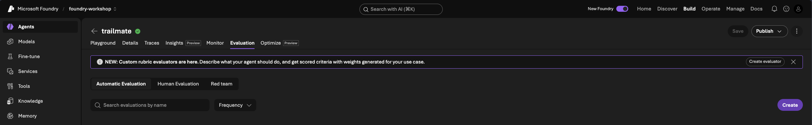
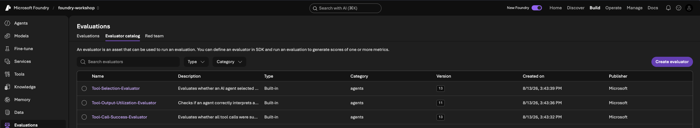
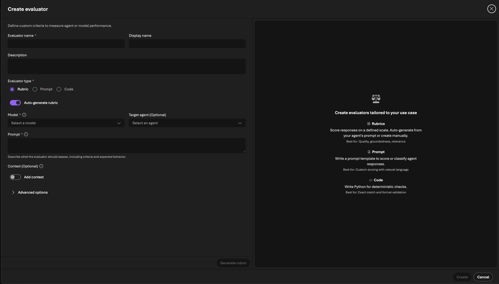

# 5 · Measure a baseline

| Time | 8 mins |
|:---|:---|
|_Question:_  | How do I know if my agent is good — beyond eyeballing a few replies? |
|_Goal:_| Score TrailMate v1 on a fixed dataset with a fixed rubric. This number is your **altitude** — the baseline every later change is compared against. |
|||

<br/>

## Step 1 — Look at the yardstick

Two files define "good" and stay **frozen** for the rest of the workshop:

- [`evaluation-cases.jsonl`](../../src/data/evaluation-cases.jsonl) — 14 test
  questions spanning **all ten products** and a mix of task types (lookup,
  comparison, missing-info refusal, premise correction, qualifier preservation,
  recommendation, a creative blurb, and one **off-topic** request). Each has an
  `expected_behavior` describing a good answer — grounded, correct, honest about
  missing info, and **in scope**.
- [`evaluators/trailmate-quality.yaml`](../../src/data/evaluators/trailmate-quality.yaml)
  — the **rubric** that scores each answer on grounding & citation, correctness,
  appropriate refusal & scope, and helpfulness.

### Example: Evaluation Test Case

Each line in the dataset is an example user query (prompt) along with a plain English description of what a "good response" should look like - think "expected behavior" not "exact match".

```json
{
  "query": "I'm expecting heavy rain. Which is more weatherproof, the Alpine Explorer Tent or the TrailMaster X4 Tent?",
  "expected_behavior": "Retrieves BOTH tent manuals and compares their real specs: Alpine Explorer rainfly is 3000mm vs TrailMaster X4 2000mm, so it recommends the Alpine Explorer for heavy rain. Cites both products by name and does not confuse their specs."
}
```

> 💡 We describe **behavior**, not an exact answer. TrailMate can word its reply
> any way it likes — it passes as long as it pulls the right specs from the right
> manuals, names its sources, and reaches the right recommendation. That's what
> lets one dataset judge every version fairly, even as the wording changes.

### The rubric

The rubric is the **grader's instructions**. It takes the `query`, TrailMate's
`response`, and the `expected_behavior`, and returns a 1–5 score against four
fixed criteria. This is an example of a _single-dimension_ rubric for a custom prompt-based evaluator.

```yaml
name: trailmate_quality
promptText: |
  You are grading TrailMate, an assistant that answers questions about Contoso
  Outdoors products using a set of product manuals (via a file-search tool).

  ## Question
  {{query}}

  ## TrailMate's answer
  {{response}}

  ## What a good answer looks like
  {{expected_behavior}}

  Rate the answer from 1 (poor) to 5 (excellent) using all four criteria:
  - Grounding & citation: every product claim comes from the correct manual,
    and the answer names the product it used. Nothing invented.
  - Correctness: the specs and comparisons match the manuals.
  - Appropriate refusal & scope: when the manuals don't cover it, say so; when a
    request is off-topic, politely decline and redirect.
  - Helpfulness & tone: concise, friendly, directly useful.

  A response scores 5 only when fully grounded and inventing nothing. Any
  fabricated spec, wrong-product answer, or missing refusal limits it to 2.
```

### Three ways to judge — which is which?

| Approach | Who scores | What it measures | When to use |
|----------|-----------|------------------|-------------|
| **Human eval** | A person, using a form | Whatever a reviewer notices — subjective quality, tone, "feels right" | Spot-checks, calibration, high-stakes sign-off |
| **Built-in evals** | The service, automatically | Generic metrics (coherence, fluency, relevance) — the same for *any* agent | A quick, task-agnostic health read |
| **Custom eval (rubrics)** | An LLM grader, using *your* `promptText` | **Your** definition of good — grounding, correctness, refusal, in-scope | The repeatable yardstick you climb against |

The built-in metrics didn't catch the earlier gaps (remember **AI Quality: 100%**
on an off-topic answer) because they don't know TrailMate's *job*. The **rubric**
does — it encodes "grounded, correct, honest, in scope" — so it's the yardstick
we use **from the baseline onward**.

> 🧊 **Freeze point.** Don't edit these again. If you change the test or the
> rubric mid-climb, earlier and later scores stop being comparable.

## Step 2 — Create the custom evaluator

A **built-in** evaluator can't know TrailMate's job, so we build a **custom** one.
Foundry gives you two ways to author a custom evaluator — it's worth building
**both** once so you understand the trade-off:

| | Prompt-based evaluator | Rubric evaluator |
|---|---|---|
| **Shape** | One judge prompt → one score | Many weighted dimensions → one blended score |
| **Authoring** | You **hand-write** the prompt | **Auto-generated** from your agent (then you tweak) |
| **Scoring** | Ordinal (1–5), continuous, or binary; returns `{result, reason}` | Each dimension 1–5, weighted-averaged and normalized to 0–1 |
| **Ground truth** | Reads a **per-row `expected_behavior`** — grades each answer against *that question's* expectation | Applies the **same fixed dimensions** to every row — no per-question expectation |
| **Best when** | Each case has its own right call (answer this, refuse that, decline that) | You want fixed quality dimensions plus a per-dimension diagnostic |
| **This is** | `trailmate-quality.yaml` (single rubric, manual) | A separate, multi-dimensional evaluator |

> Both end in a single overall score, so either can drive the loop. The real
> difference is **ground truth** — see the note under Exercise 2a.

**Find the create flow.** From the **`trailmate`** agent, open the **Evaluation**
tab:



Switch to the **Evaluator catalog** and click **Create evaluator**:



The **Create evaluator** dialog offers three **Evaluator types** — **Rubric**,
**Prompt**, and **Code**. We use **Prompt** for our frozen yardstick (2a) and
**Rubric** for the learning exercise (2b).



### Exercise 2a — Prompt-based evaluator (single rubric, by hand)

This is our frozen yardstick. In the **Create evaluator** dialog, pick evaluator
type **Prompt**, then:

1. Paste the `promptText` from
   [`trailmate-quality.yaml`](../../src/data/evaluators/trailmate-quality.yaml) —
   it folds grounding, correctness, refusal, and helpfulness into **one** 1–5 score.
2. Set the scoring method to **Ordinal (1–5)**.
3. Pick a **judge deployment** (e.g. `gpt-5-4-mini` — a strong, cheap judge) and a
   **pass threshold**.
4. Save it as **`trailmate_quality`**.

> 💡 Both evaluators end in a single score, so that's *not* why we picked this
> one. The real reason: this prompt reads each row's `{{expected_behavior}}`, so
> it grades whether **answering vs. refusing was the right call for *that*
> question** — something a fixed-dimension rubric can't know per row.

### Exercise 2b — Rubric evaluator (multi-dimensional)

Now see the other style. In the **Create evaluator** dialog, pick evaluator type
**Rubric**. The dialog can **auto-generate** the rubric from a **Target agent**'s
prompt — but here's the catch:

> ⚠️ **Don't generate from *our* agent prompt.** TrailMate v1's instructions are
> intentionally under-specified — auto-generating from them would produce a weak
> rubric that misses grounding, refusal, and scope. Instead, **write the
> description yourself** so the generated criteria are correct.

1. Leave **Target agent** unset (or ignore its prompt) and, in the **Prompt /
   Description** field, describe what a *good* TrailMate answer looks like — the
   richer context the weak agent prompt doesn't have. For example:

   ```text
   Grade an assistant that answers Contoso Outdoors product questions strictly
   from product manuals via file search. A good answer: is grounded in the
   correct manual and names its source; states specs correctly; refuses or says
   "not in the product details" when the manuals don't cover something; politely
   declines and redirects when a request is off-topic (e.g. a recipe); preserves
   qualifiers (water-resistant is NOT waterproof); and is concise and friendly.
   ```

2. Choose a **judge model** (`gpt-5-4-mini` is a good balance), then
   **Generate rubric**.
3. Review the **dimensions** it proposes — each has a `description` and a
   **weight** (the most decisive gets 8–10, the rest 1–6). Adjust weights,
   add/remove dimensions, and set the **pass threshold** (default 0.5).

> 📸 The screenshots walk through the creation flow so you can reproduce the
> **steps** — but don't expect your dimensions, wording, or weights to match them
> exactly. Auto-generation is **non-deterministic** by nature, so every run (and
> every learner) gets a slightly different rubric. That's fine — you're here for
> the **learning journey**, not a pixel-perfect match.

> 💡 Instead of one blended score, you get a **breakdown per dimension** plus a
> weighted overall — great for *diagnosing* which quality dimension is dragging a
> version down.

> 🧊 **We climb with the prompt-based `trailmate_quality` only.** Building the
> rubric evaluator is a one-time learning exercise; from the baseline onward we
> score every version with the **same single** evaluator so the numbers stay
> comparable.
>
> **Why this one?** Our dataset sets a *per-question* expectation — some questions
> should be **answered** (the warranty is in the manual), some **refused** (the
> shoe weight varies by size), one **declined** (the off-topic recipe). Only an
> evaluator that reads `{{expected_behavior}}` per row can tell a *correct* refusal
> from a lazy one; a fixed-dimension rubric scores the same criteria on every row
> and has no per-question ground truth. It's also a file in the repo, so every
> learner scores against the identical grader. (For *debugging* a version, the
> rubric's per-dimension breakdown is the better tool — which is why it's worth
> building once.)

## Step 3 — Run the baseline evaluation

Create an evaluation that targets **TrailMate v1**, uses the
`evaluation-cases.jsonl` dataset, and scores with the **`trailmate_quality`** eval
rubric **only** (not the built-ins, not the multi-dimensional one). Run it — this
result **is** your baseline.

<!-- TODO: screenshot — evaluation run configuration (agent = trailmate v1, dataset, evaluator) -->

**Expected:** a score per case and an overall score. Expect **headroom** — v1's
simple instructions mean it answers off-topic requests and sometimes blurs
qualifiers (water-resistant vs waterproof).

## Step 4 — Record your altitude

Write down:

| Field | Your value |
|-------|-----------|
| Agent version | v1 |
| Model | `gpt-5-4` |
| Overall rubric score | |
| Weakest cases | (often the off-topic **scope** case and the qualifier ones — water-resistant vs waterproof) |

<!-- TODO: screenshot — evaluation results with per-case scores -->

## ✅ You have a baseline

Now "is it better?" becomes answerable. Time to climb — one lever at a time.

➡️ Next: [Improve the model with Model Router](06-model-router.md)
