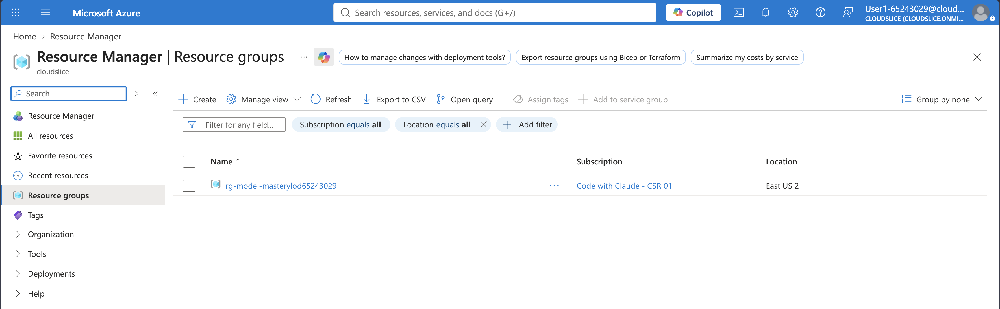
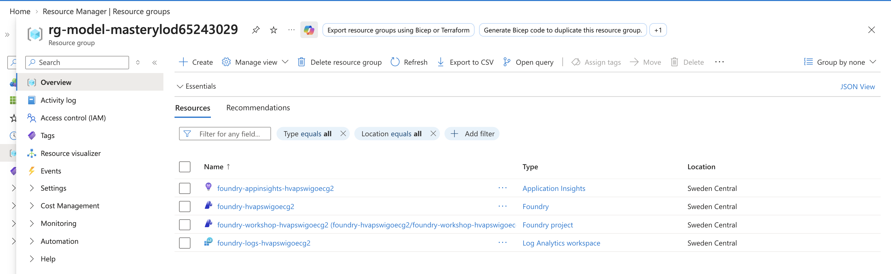
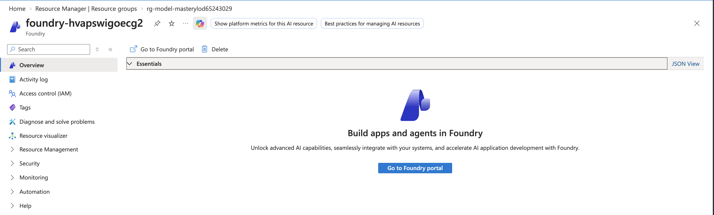
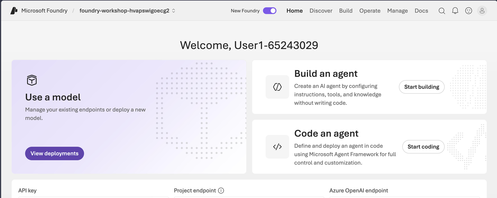
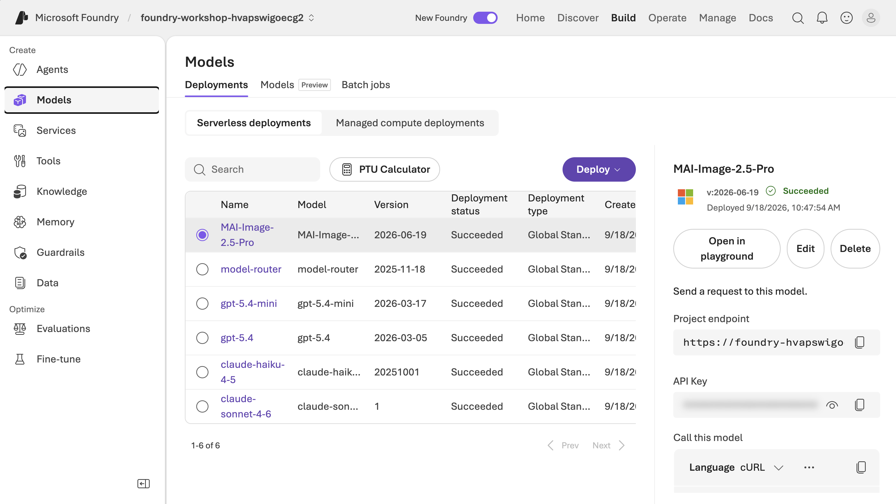
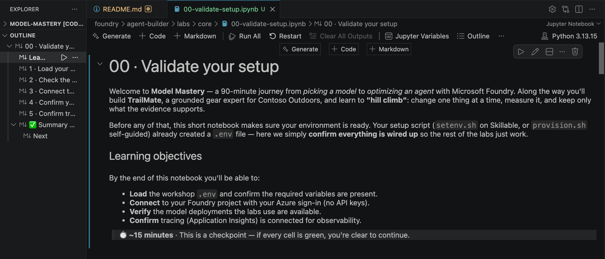

# Skillable Setup — Instructor-Led

In this instructor-led session your Azure infrastructure is **already
provisioned** for you. You won't create any resources — you'll confirm what's
there, set up your development environment in GitHub Codespaces, generate a
local `.env`, and then start the labs.

> When you finish this page, you'll open
> [`labs/core/00-validate-setup.ipynb`](../../labs/core/00-validate-setup.ipynb)
> and continue notebook to notebook from there.

## Prerequisites

1. A **laptop**, plugged in — you'll work in the browser for the whole session.
1. A **modern web browser** (recent Edge, Chrome, Firefox, or Safari).
1. A **personal GitHub account** — a work/enterprise account will not work for
   Codespaces. Create a free personal one if needed.

## Step 1 — Launch your Skillable VM

1. Open the lab URL provided by your instructor.
1. You'll see the Skillable lab page with **Instructions** and **Resources** tabs.
1. Confirm the lab title matches this workshop.

<!-- TODO: screenshot — Skillable lab page → assets/01-01-skillable-lab.png -->

## Step 2 — Find your Azure details

1. Click the **Resources** tab.
1. Confirm you can see your **Azure username**, **TAP**, and **resource group
   name** (of the form `rg-model-mastery-xxxx`). They should not be empty.
1. Keep this tab open — you'll use these values in Step 5.

<!-- TODO: screenshot — Resources tab with credentials + resource group → assets/01-02-resource-links.png -->

## Step 3 — (Optional) Verify your resources in the Azure portal

1. In a new tab, open [https://portal.azure.com](https://portal.azure.com) and
   sign in with the **Azure username** and **TAP** from Step 2.
1. Open **Resource groups** and select your `rg-model-mastery-xxxx` group.

   

1. Confirm it contains a **Foundry** resource, a **Foundry project**, an
   **Application Insights** resource, and a **Log Analytics** workspace.

   

1. Open the **Foundry** resource and choose **Go to Foundry**.

   

1. You land on the **Foundry portal** home, where you can see your project and its
   API endpoint.

   

1. Go to **Build → Models** and confirm the six deployments: `gpt-5.4`,
   `gpt-5.4-mini`, `model-router`, `MAI-Image-2.5-Pro`, `claude-sonnet-4-6`,
   `claude-haiku-4-5`.

   

## Step 4 — Fork the repo and open Codespaces

1. Sign in to GitHub with your **personal** account.
1. Fork [https://aka.ms/model-mastery](https://aka.ms/model-mastery) to your profile.
1. Open the `main` branch in **GitHub Codespaces** and wait until VS Code is ready
   (the dev container installs Python, the Azure CLI, and all notebook packages).

## Step 5 — Generate your `.env`

Run each command on its own (from the repository root in the Codespaces terminal):

```bash
cd foundry/agent-builder/scripts
```

```bash
./setenv.sh
```

1. If prompted, complete the Azure sign-in device-code flow using your
   **Skillable Azure credentials**:

   ```text
   You're not signed in to Azure. Launching 'az login'...
   To sign in, use a web browser to open https://login.microsoft.com/device and enter the code XXXXX
   ```

1. When asked for a **resource group name**, enter the one from Step 2
   (`rg-model-mastery-xxxx`).
1. **Expected:** the script prints your **project endpoint** and **Application
   Insights connection string**, and writes `foundry/agent-builder/src/.env`.

<!-- TODO: screenshot — setenv.sh success + generated .env → assets/01-08-setenv-done.png -->

## Step 6 — Using the notebooks

The labs are **Jupyter notebooks** — a mix of explanation and runnable code. A few
habits make them easy and rewarding to work through:

1. **Open the notebook.** In the VS Code Explorer, open
   `foundry/agent-builder/labs/core/00-validate-setup.ipynb`.
1. **Select the Python kernel.** At the top-right of the notebook, click
   **Select Kernel** and choose the **Python 3** environment the dev container set
   up. (If prompted to install the Python/Jupyter extensions, accept — they're
   already included.)
1. **Clear old outputs first.** So you see *your own* results, clear any saved
   output: **⋯ (More Actions) → Clear All Outputs**. This gives you a clean slate.
1. **Run cell by cell — don't "Run All".** Use **Shift+Enter** to run a cell and
   move to the next. Going one cell at a time lets you *read the markdown, run the
   code, and see the impact* before moving on — that's where the learning happens.
1. **Keep the Outline open.** Each notebook is a numbered narrative (1, 2, 3…).
   Open the **Outline** view (in the Explorer sidebar, or **View → Open View… →
   Outline**) to see the whole story at a glance and jump between steps.

   

> 💡 If a code cell errors <br/> Read the message, fix or re-run, and continue — you don't need to restart. Each notebook reuses the same `.env`, so once setup is validated the rest just works.

> 💡 If you make changes that cause the `.env` to change, then use "Restart" to update the kernel runtime. <br/> 

## Next

Your environment is ready. Open
[`labs/core/00-validate-setup.ipynb`](../../labs/core/00-validate-setup.ipynb)
and run it to confirm everything is wired up — then continue through the core
labs in order.
